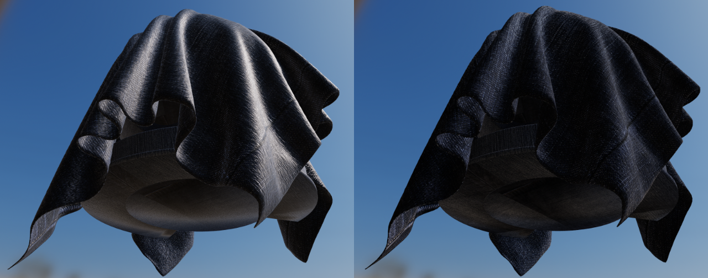

# 4.12 Cloth model

原文地址：[Physically Based Rendering in Filament](https://google.github.io/filament/Filament.md.html#materialsystem/clothmodel)

前面描述的所有材质模型都是为了在宏观和微观层面模拟致密表面而设计的。然而，衣服和织物通常由松散连接的线制成，这些线吸收和散射入射光。早期提出的 Microfacet BRDF 在再现布料的性质方面做得很差，因为它们的基本假设是表面由随机凹槽组成，而这些凹槽的行为就像完美的镜子。与硬质表面相比，布料的特点是镜面波瓣较软，衰减较大，并且存在由前向/后向散射引起的模糊照明。一些织物还表现出双色镜面颜色（例如天鹅绒）。

图 29 展示了传统的 Microfacet BRDF 无法捕捉到牛仔织物的外观。其表面看起来很硬（几乎像塑料），更像防水布而不是一件衣服。该图还显示了吸收和散射引起的较软镜面波瓣对织物可信服地渲染的重要性。


图 29：使用传统微表面BRDF（左）和我们的布料 BRDF（右）渲染的牛仔面料的比较

天鹅绒（Velvet）是布料模型的一个有趣用例。如图 30 所示，这种织物由于前后散射而表现出强烈的边缘光照。这些散射事件是由织物纤维笔直地站在织物表面引起的。当入射光来自与观察方向相反的方向时，纤维将向前散射光。同样，当入射光的方向与观察方向相同时，纤维会将光向后散射。


图 30：天鹅绒面料展示了向前和向后的散射

由于纤维是柔性的，理论上我们应该模拟其梳理表面的能力。虽然我们的模型没有复制这一特性，但它确实模拟了可见的正面镜面反射，这可以归因于纤维方向的随机变化。

值得注意的是，有些类型的织物仍然最好采用硬表面材料模型。例如，皮革、丝绸和绸缎可以使用标准或各向异性材料模型进行重现。

## 4.12.1 Cloth specular BRDF

我们使用的布料镜面 BRDF 是 Ashikhmin 和 Premoze 在其论文$\mathrm{[Ashikhmin07]}$中描述的改进型 microfacet BRDF。Ashikhmin 和 Premoze 在他们的著作中指出，分布项对 BRDF 的贡献最大，而对于他们的天鹅绒分布而言，阴影/遮蔽项并非必要。分布项本身是一个倒高斯分布。这有助于实现模糊照明（前向和后向散射），同时添加偏移量来模拟前向镜面反射。所谓的天鹅绒 NDF 定义如下：

$$
D_{\mathrm{velvet}}(v, h, \alpha) = c_{\mathrm{norm}} \left(1 + 4 \exp \left( \frac{-\cot^{2} \theta_{h}}{\alpha^{2}} \right) \right)
\tag{46}
$$

该 NDF 是同一作者在 《A Microfacet-based BRDF Generator》 中描述的 NDF 的变体，特别是经过修改，加入了偏移（此处设为 1）和振幅（4）。在 $\mathrm{[Neubelt13]}$ 中，Neubelt 和 Pettineo 提出了该 NDF 的规范化版本。

$$
D_{\mathrm{velvet}}(v, h, \alpha) = 
\frac{1}{\pi (1 + 4 \alpha^{2})} 
\left(1 + 4 \frac{\exp \left( \frac{-\cot^{2} \theta_{h}}{\alpha^{2}} \right)}{\sin^{4} \theta_{h}} \right)
\tag{47}
$$
对于完整的镜面 BRDF，我们依旧按 $\mathrm{[Neubelt13]}$ 如法炮制，用更平滑的变体替换传统的分母：

$$
f_r(v,h,\alpha) = \frac{D_{\mathrm{velvet}}(v,h,\alpha)}{4 \big(n \cdot l + n \cdot v - (n \cdot l)(n \cdot v)\big)}
\tag{48}
$$
清单 17 介绍了天鹅绒 NDF 的实现方法，它已被优化到能够适应 half float 格式，并且避免了计算开销昂贵的余切值，而是依赖于三角函数等式。需要注意的是我们已将菲涅尔部分从该 BRDF 中移除。

```cpp
float D_Ashikhmin(float roughness, float NoH) {
    // Ashikhmin 2007, "Distribution-based BRDFs"
	float a2 = roughness * roughness;
	float cos2h = NoH * NoH;
	float sin2h = max(1.0 - cos2h, 0.0078125); // 2^(-14/2), so sin2h^2 > 0 in fp16
	float sin4h = sin2h * sin2h;
	float cot2 = -cos2h / (a2 * sin2h);
	return 1.0 / (PI * (4.0 * a2 + 1.0) * sin4h) * (4.0 * exp(cot2) + sin4h);
}
```
清单 17：Ashikhmin 的天鹅绒 NDF 的 GLSL 实现

在 $\mathrm{[Estevez17]}$ 中，Estevez 和 Kulla 提出了一种不同的 NDF（称为 Charlie Sheen），它基于指数化正弦曲线而不是倒高斯曲线。这种 NDF 有几个吸引人的原因：其参数化感觉更自然、更直观，外观更柔和，而且如等式 49 所示，其实现更简单：

$$
D(m) = \frac{(2+\frac1\alpha)\sin(\theta)^{\frac1\alpha}}{2\pi}
\tag{49}
$$
$\mathrm{[Estevez17]}$ 还提出了一个新的阴影项，由于其成本，我们在这里省略了它。相反，我们依赖于 $\mathrm{[Neubelt13]}$ 中的能见度项（如上文公式 48 所示）。此 NDF 的实现如清单 18 所示，已优化为能够适应 half float 的格式。

```cpp
float D_Charlie(float roughness, float NoH) {
    // Estevez and Kulla 2017, "Production Friendly Microfacet Sheen BRDF"
    float invAlpha  = 1.0 / roughness;
    float cos2h = NoH * NoH;
    float sin2h = max(1.0 - cos2h, 0.0078125); // 2^(-14/2), so sin2h^2 > 0 in fp16
    return (2.0 + invAlpha) * pow(sin2h, invAlpha * 0.5) / (2.0 * PI);
}
```
清单 18：Charlie NDF 的 GLSL 实现
### 4.12.1.1 Sheen color

为了更好地控制布料的外观，并让用户能够重建双色镜面材质，我们引入了直接修改镜面反射率的能力。图 31 展示了使用我们称之为“光泽颜色”(sheen color)的参数的示例。


图31：无光泽（左）和有光泽（右）的蓝色织物
## 4.12.2 Cloth diffuse BRDF

我们的布料材质模型仍然依赖于 Lambertian diffuse BRDF。不过也稍微修改了一下该模型以实现能量守恒（类似于我们的清漆材质模型的能量守恒），并提供了一个可选的次表面散射项。这个附加项并非基于物理的，它可用于模拟某些类型织物的散射、部分吸收和再发射。

首先，这是不带可选的次表面散射的漫反射项：

$$
f_d(v,h)=\frac{c_diff}{\pi}\left(1-F(v,h)\right)
\tag{50}
$$

其中$F(v,h)$是公式 48 布料镜面 BRDF 的菲涅尔项，在实践中，我们选择省略漫反射分量中的$1-F(v,h)$项，因为其效果比较细微，我们认为不值得增加成本。

次表面散射是使用能量守恒形式的环绕漫反射照明(wrapped diffuse lighting)技术实现的：

$$
f_{d}(v, h) = \frac{c_{\mathrm{diff}}}{\pi} (1 - F(v, h)) 
\left\langle \frac{n \cdot l + w}{(1 + w)^{2}} \right\rangle 
\langle c_{\mathrm{subsurface}} + n \cdot l \rangle
\tag{51}
$$

其中，$w$是一个介于 0 和 1 之间的值，它由漫反射光环绕终端的程度定义。为了避免引入另一个参数，我们固定$w=0.5$。需要注意的是，在使用环绕漫反射光时，漫反射项不能乘以$n⋅l$。图 32 显示了这种廉价的次表面散射近似的效果。


图32：白色布料（左列）与带有棕色次表面散射的白色布料（右列）

我们的布料 BRDF 的完整实现，包括光泽颜色和可选的次表面散射，可以在清单 19中找到。

```cpp
// specular BRDF
float D = distributionCloth(roughness, NoH);
float V = visibilityCloth(NoV, NoL);
vec3  F = sheenColor;
vec3 Fr = (D * V) * F;

// diffuse BRDF
float diffuse = diffuse(roughness, NoV, NoL, LoH);
#if defined(MATERIAL_HAS_SUBSURFACE_COLOR)
// energy conservative wrap diffuse
diffuse *= saturate((dot(n, light.l) + 0.5) / 2.25);
#endif
vec3 Fd = diffuse * pixel.diffuseColor;

#if defined(MATERIAL_HAS_SUBSURFACE_COLOR)
// cheap subsurface scatter
Fd *= saturate(subsurfaceColor + NoL);
vec3 color = Fd + Fr * NoL;
color *= (lightIntensity * lightAttenuation) * lightColor;
#else
vec3 color = Fd + Fr;
color *= (lightIntensity * lightAttenuation * NoL) * lightColor;
#endif
```
清单 19：我们的布料 BRDF 的 GLSL 实现
## 4.12.3 Cloth parameterization

布料材质模型包含之前为标准材质模式定义的所有参数，除了金属和反射率。表格 8 还提供了两个额外的参数可供使用：

| 参数名             | 定义                                  |
| --------------- | ----------------------------------- |
| SheenColor      | 镜面色调，用于创建双色镜面织物（默认值为 0.04，以匹配标准反射率） |
| SubsurfaceColor | 在材质散射和吸收之后的漫反射颜色的色调                 |
表格 8：布料模型的参数

> 译者注：最后这段略显晦涩，故略作增补此段内容，较原文可能有明显不同

根据上文易得，织物的渲染主要分为基础色和光泽色，二者相加得到最终渲染结果。

要创建类似天鹅绒的材质，可将基础色设置为黑色或类似的暗色，因为天鹅绒的主表面会吸收大部分光线，呈现深色。然后通过 sheen color 来控制材质的色度（颜色表现）。例如经典天鹅绒就是黑色基底加红色光泽

要制作更常见的织物材质，如牛仔布、棉布等，基础色是织物颜色，sheen color 则只应当提供一个明度值（而不带颜色），一般要么是一个默认值白色，要么是基础色的明度。 

什么是色度？就是色调（Hue）和饱和度（Saturation），它排除了明度（Luminance）的影响。例如红色`#ff0000`和暗红色`#800000`的色度相同（都是纯红），但明度不同。
# Quotation

$\mathrm{[Ashikhmin07]}$ Michael Ashikhmin and Simon Premoze. 2007. Distribution-based BRDFs.
$\mathrm{[Ashikhmin00]}$ Michael Ashikhmin, Simon Premoze and Peter Shirley. A Microfacet-based BRDF Generator. _SIGGRAPH '00 Proceedings_, 65-74.
$[\mathrm{Neubelt13}]$ David Neubelt and Matt Pettineo. 2013. Crafting a Next-Gen Material Pipeline for The Order: 1886. _Physically Based Shading in Theory and Practice, ACM SIGGRAPH 2013 Courses_.
$[\mathrm{Estevez17}]$ Alejandro Conty Estevez and Christopher Kulla. 2017. Production Friendly Microfacet Sheen BRDF. _ACM SIGGRAPH 2017_.