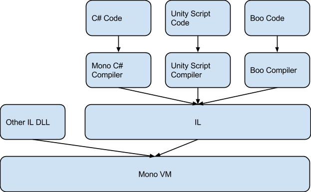
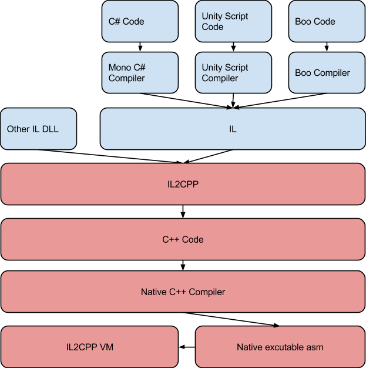

#hotfix
# Intro

## The Historical Limitation of Mono

例行放一下别人的基础概念讲解的博客：[Zhihu - 从零开始讲解HybirdCLR 热更](https://zhuanlan.zhihu.com/p/685026219)

结合上面的博客，大致理解如下基础概念：

HybridCLR 的提出是去解决原先 IL2CPP 的局限性的，那就得先知道 IL2CPP 解决了什么问题。而 IL2CPP 的设计初衷又是去解决 mono 的局限性的，它通过牺牲动态性（如热更新），换取更高的性能和跨平台合规性。

原本 mono 的代码是这也的：



可以看到 mono 的本质是在不同平台上通过虚拟机运行或编译 IL（Intermediate Language）代码，mono 有两种运行方式：JIT 和解释执行，其中解释比 JIT 还慢 5~10 倍。此外在跨平台方面，Mono 有几个平台就得移植几个 VM，包括 JIT 编译器、GC、线程管理、异常处理等内容。但是每个平台差异显著，其系统调用、内存管理、线程模型不尽相同，所以新增一个平台的适配工作量巨大。

而 IL2CPP 经过 AOT，所有代码在构建阶段已编译为机器码，运行时直接执行，无额外编译或解释开销，其流程如下所示：



AOT 的好处是显而易见地：

- 减少了运行时的开销
- CPP 语言本身执行速度就有优势
- C++ 编译器（如 Clang、MSVC）能对代码进行内联、循环展开、指令重排等深度优化

另一方面虽然 IL2CPP 也得在各个平台准备运行时，但是它用了一种类似于引擎渲染提到的 RHI 层的概念。我们知道 RHI 层做了这么一件事：

- 上层（游戏引擎）：调用统一的 RHI 接口（如 `DrawMesh`）
- 中间层（RHI 抽象）：将通用指令转换为具体 GPU API 调用（如 DX12/Vulkan）
- 底层（平台实现）：各 GPU 厂商的驱动处理硬件差异

而 IL2CPP 也采取了类似的设计思想，将大部分逻辑做成了平台无关的，把跨平台的关键工作交给了各个平台成熟 C++ 编译器（如 Clang/MSVC/GCC）生成最终机器码：

- 上层（C# 代码）：统一的 C# 逻辑（如 GC、反射）
- 中间层（libil2cpp 核心）：提供跨平台的运行时服务（如类型系统、异常处理）
- 底层（平台适配层）：通过 HAL 封装线程、文件系统等平台相关操作

运行时（libil2cpp）涵盖了中间层（平台无关层）和底层（平台适配层）两部分，其中大部分代码位于平台无关层，少量代码位于平台适配层，针对新平台需要做的适配工作主要集中在平台适配层，较之 mono 的移植工作，其工作量已极大减少

> Write once, compile anywhere 即 WOCA 是一种编程理念/设计哲学

这样看来似乎 IL2CPP 已臻完美，但是其 AOT 的工作方式并不是毫无缺点的。它需要更多的打包时间，同时 AOT 的编译方式会导致代码“固化”，因此无法在运行时加载新的 C# 代码。就其原理来看，是因为转化的 C++ 代码只保留了必要的元数据（被“裁剪”只保留了必要的），热更新程序集的元数据不存在，自然也无法查找和运行其内容。

本着“缺什么补什么”的思想，HybridCLR 在加载热更新 DLL 的时候将其元数据注册到 IL2CPP 运行时，并生成了配套的调用方式和 IL2CPP 运行时支持。

## The Role of Metadata

元数据在支持反射、动态类型检查、序列化等高级功能的语言中被广泛使用，当然反过来说并非所有语言都支持元数据。

为什么热更新需要元数据？这要从静态编译说起。静态编译是最常见的方式，是一种在编译期（而非运行时）确定函数调用的具体地址（绝对或相对地址）和实现方式，其核心特点是无运行时查找开销，直接通过固定地址调用函数。

```asm
; C++ 代码: int result = Calc(1, 2);
push 2           ; 参数压栈
push 1
call 0x12345678  ; 直接调用固定地址
mov [result], eax ; 保存返回值
```

然后问题就很明显了，调用的函数的地址是硬编码写死的，无法动态修改为新函数的地址。热更新的核心目标是在运行时动态加载新代码或修改现有逻辑，那为了能够调用热更新补充/替换的函数，就需要能够运行时获取到新函数的地址并且能够动态修改函数调用新地址。

一些常见的方案有：

1. 函数指针：需要主工程预留接口，是有局限性的
2. 动态代码生成（JIT 环境）
3. 脚本桥接（Lua/JS）
4. 元数据 + 代码动态注册

HybridCLR 热更新的内容是<mark>代码 + 元数据</mark>，<mark>依据配套元数据“按名查找”</mark>实现热更新代码的调用。既然知道了大方向是按名查找，怎么生成和使用元数据也是围绕这个目的展开的。

比如说一个热更新代码调用了一个方法`BattleHelper.CalDamage(int,int)`，在实际执行的时候会通过元数据表查找`BattleHelper`类的元数据（如果`BattleHelper`也是热更代码，那动态载入元数据也是要做的事情），然后尝试从中匹配方法签名，匹配成功说明可以调用这个函数，根据记录的函数地址访问即可。

这种执行方式类似于 eval 方式，以 JS 为例相关代码是这样的：

```javascript
// 通过字符串动态执行代码
const funcName = "calculate";
eval(`${funcName}(1, 2);`); // 动态调用 calculate(1, 2)
```

而类似的 C# 代码则是这样：

```csharp
// 通过字符串反射调用（依靠元数据）
Type type = Type.GetType("BattleHelper"); // 动态查找类
MethodInfo method = type.GetMethod("CalDamage"); // 动态查找方法
method.Invoke(null, new object[] { 1, 2 }); // 动态执行
```

两者均需在运行时完成名称解析→函数绑定→调用的流程，但是和 eval 不同的地方在于并非直接解释执行。

如果是 eval 方式，是需要有相应的运行环境/虚拟机的，xLua/PuerTS 这类脚本化热更新方案的核心机制可以都归类为 eval 式动态执行（但是肯定比传统的 eval 复杂）

## Managed Code

> 托管内存和元数据是紧密相关的两个核心概念，它们共同构成了托管代码运行的基础。

C# 或者 IL 都是托管代码（Managed Code），具有以下特点：

- 由垃圾回收器（GC） 自动管理内存。
- 依赖元数据进行类型检查、反射等操作。
- 跨平台，因为 IL 代码可以在不同运行时（如 Mono、.NET Core）上执行。

上面提到了 IL2CPP 的核心任务是将托管代码转换成 C++ 代码，再编译为平台相关的本地机器码（Native Code），即这样一个过程：

```
C# 代码 → (编译) → IL 代码 → (IL2CPP 转换) → C++ 代码 → (平台编译器) → 机器码（x86/ARM等）
```

C# 的高级特性（GC、反射、异常等）深度依赖 .NET 运行时，纯 C++ 无法完全模拟，因此 IL2CPP 在生成 Native Code 后仍需保留部分 .NET 运行时机制，从而在获得 Native 性能的同时不丢失 C# 的语义。

例如，如果没有完整的类型系统，C# 的装箱和拆箱机制将无法实现。这是因为拆装箱本质上依赖于运行时对值类型和引用类型的元数据动态识别和转换，考虑如下代码：

```csharp
int num = 42;
object boxed = num;
```

该操作对应的底层行为：

1. 运行时根据值类型的元数据（大小、布局）在托管堆分配内存。
2. 将值类型的数据复制到新分配的内存中。
3. 返回一个指向该内存的引用（对象头包含类型元数据）。

可以在这篇文章中查到有关 Object 与对象头的相关信息：[Microsoft Dev Blogs - Managed object internals, Part 1. The layout](https://devblogs.microsoft.com/premier-developer/managed-object-internals-part-1-layout/)。简单来说就是 Object 实例除了本身的数据，还额外有一些辅助数据，例如对象头，依赖这些特有的数据完成拆装箱。

当然 Object 的实现只是 C# 高级特性的一个方面，总而言之 IL2CPP 的角色是将 C# 特性映射到 C++，通过模拟的手段实现高级特性。但是 IL2CPP 对这些高级特性的模拟是有限的，

# A glimpses of HybridCLR

官方文章：[HybridCLR Blog - hybridclr技术原理剖析](https://hybridclr.doc.code-philosophy.com/blog/principle)

顾名思义，HybridCLR 是一种 CLR，具有 Hybrid 的特点，那就要看 Hybrid 是怎么一回事了。

Hybrid 的意思是混合，这一点正是它实现热更新的核心要义，即执行方式的混合——AOT 代码采用静态编译而热更新部分代码则是解释执行，或者说原生机器码与IL指令共存于进程中混合执行。也就是说，HybridCLR 通过拓展 IL2CPP 运行时的功能，使之能够动态解释执行未被 AOT 编译的 IL 指令，从而代替了处处受限的 JIT 方式。

代码的执行分为逻辑的载入和实际的调用两个阶段，核心思路是“分类注册 + 动态路由”。在载入时会分类注册，常规 AOT 代码和原生 IL2CPP 执行无异，热更新代码则动态注册到 HybridCLR 维护的运行时系统中。在调用阶段会进行动态路由，通过维护的全局映射表，记录每个方法是 AOT 编译的机器码入口，还是需要解释的 IL 代码（interpreterEntry）。调用的函数属于 AOT 就正常调用执行，不是的话就走解释执行。开发人员则是无感的，只是知道调用了个函数。