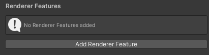

#URP 
# Intro

`ScriptableRendererFeature`是 URP 独有的机制，用于向 URP 的渲染流程中添加自定义 `ScriptableRenderPass`。它通过 `ScriptableRendererFeature.AddRenderPasses` 方法将 `ScriptableRenderPass` 添加到 `ScriptableRenderer` 中。

就原理而言：

`ScriptableRenderer.AddRenderPasses(ref RenderingData)`会被派生类在`ForwardRenderer.Setup()`的时候的时候完成 Pass 的插入。在`ScriptableRenderer`中维护了一个`List<ScriptableRendererFeature>`，会遍历拿到启用的 Feature 并调用其提供的`AddRenderPasses(ScriptableRenderer, ref RenderingData)`。
## Detail

重写`Create()`方法，此方法会在管线的 Render Asset 中点击`Add Renderer Feature`时调用。



具体的逻辑则在`AddRenderPasses`中完成，此方法将一个或多个`ScriptableRendererPass`插入到到渲染队列中

## Enqueue 机制

首先是`RenderFeature`的获取，源自`ScriptableRenderer`的构造函数：

```csharp
public ScriptableRenderer(ScriptableRendererData data)
{
	// ...
	foreach (var feature in data.rendererFeatures)
	{
		if (feature == null)
			continue;
			
		feature.Create();
		m_RendererFeatures.Add(feature);
	}
	// ...other code
}
```

已知队列是个`List<ScriptableRenderPass>`。然后在`Setup()`就该入队的就入队了。但是那是 URP 已准备的 Pass 的入队。`RenderFeature`的 Pass 的入队发生在这里：

```csharp
for (int i = 0; i < rendererFeatures.Count; ++i)
{
	if (!rendererFeatures[i].isActive)
	{
		continue;
	}
	rendererFeatures[i].AddRenderPasses(this, ref renderingData);
}
```

这个会在`Setup()`添加所有 pass 最前面进行。

然后`ScriptableRenderer`里实现了`SortStable(List<ScriptableRenderPass>)`，在这里实现了稳定插入排序。因为`ScriptableRenderPass`是重载了比较运算符的，所以这里直接就可以拿来比。它在`ScriptableRenderer.Execute()`时被调用。

总体说来就是每帧先添加自定义 pass，在添加 URP 内置 Pass，然后再实际渲染的时候排序，按顺序执行。
## Acquire Texture

写 RenderFeature 是绕不开 RenderTarget 的获取的，因此在这里整理一下。

# Example : SSAO

URP 内置的 SSAO 效果作为一个 RenderFeature 是一个很好理解这个机制的参考。

这个 RenderFeature 内保存了用到的资源，例如实现 SSAO 的着色器和材质，也提供了检查这些资源是否存在的方法。在`AddRenderPasses`中的逻辑也很简明，如下所示（当然我也做了简化）：

```csharp
if(!GetMaterial()) // 报错
bool shouldAdd = m_SSAOPass.Setup(m_Settings);
if (shouldAdd) renderer.EnqueuePass(m_SSAOPass);
```

不难看出`AddRenderPasses`的作用就是使 Pass 进入队列。

为了便于配置，还专门新建了一个`ScreenSpaceAmbientOcclusionSettings`，用作 DTO。`ScreenSpaceAmbientOcclusionPass`在构造函数添加了这个类的实例，并在`Setup(ScreenSpaceAmbientOcclusionSettings)`中依据它进行参数配置。

> 存在一个`override void OnCameraSetup`不知道是从哪继承来的。

`Execute()`则利用 CommandBuffer 实现了相关渲染命令的提交，先渲染了 AO 信息，然后再模糊，甚至流程都做好了枚举：

```csharp
private enum ShaderPasses
{
	AO = 0,
	BlurHorizontal = 1,
	BlurVertical = 2,
	BlurFinal = 3
}
```

绘制方式是这样的：

```csharp
cmd.DrawMesh(RenderingUtils.fullscreenMesh, Matrix4x4.identity, material, 0, (int) pass);
```

调用 CommandBuffer 绘制了一个全屏 Mesh 用于呈现全屏效果，`Matrix4x4.identity`指明无变换（直接覆盖屏幕），至于最后一个参数则是调用的 Pass 的编号。Unity 会根据 Shader 文件中`Pass{...}`块的声明顺序从 0 开始分配索引。显然每个 Pass 分别完成了 SSAO 的一个阶段。

Q&A：

为什么不用`Graphics.Blit`？因为他是 Built-in RP 的 API，URP 中推荐用 `DrawMesh + fullscreenMesh`，因为它更透明可控（例如可以修改顶点数据）。

# 性能注意事项

1. 避免每帧创建 Material，即避免在`Excute()`中动态生成，而是预先创建好复用
2. 避免使用过多 Pass，在合理的时机可以使用 Compute Shader