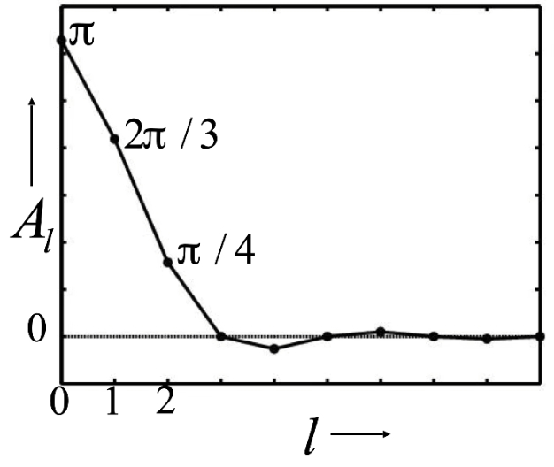

# 引

环境映射 (Environment Mapping) 是一种用于模拟物体表面的反射效果的渲染技术。它通过预先计算好环境周围的图像，然后根据物体表面的法线和视角，从预计算的图像中提取相应的像素来模拟反射，使其看起来像是在反射周围的环境。 这是一种相对高效的近似反射计算方法，避免了复杂的射线追踪。

# IBL与Environment Lighting

## 什么是IBL

IBL是一种模拟Environment Lighting的技术，主要利用六面体（Cubemap）或球体（Spheremap）的环境贴图来模拟。这些环境贴图<mark>至少</mark>存放了中心点像各个方向看过去所观察到的颜色信息。

显然这无法扑捉到多次反射或者折射，但对于许多实时渲染应用来说，这种近似已经足够好，并且计算效率很高。

为什么说是至少，是因为还可能有额外的信息，例如光照方向等。

不过IBL假设周围物体离中心足够远，如果周围物体到中心距离确定，则效果不是很符合预期

## IBL如何参与渲染方程

$$
L_o(p,\omega_o) = \int_{\Omega^+}L_i(p,\omega_i)f_r(p,\omega_i,\omega_o)\cos \theta_i V(p,\omega_i) d\omega_i
$$

IBL为渲染方程提供了高效计算$L_i(p, ω_i)$的间接光照部分的方法，相关信息会作为间接光照部分的近似值（直接光照由场景中的光源给出）。因为该项表示从各个方向入射到点 $p$ 的光线的辐射亮度，换句话说是场景中所有光源（包括直接光源和间接光源）对点 $p$ 的贡献的综合结果。

当然IBL在任何方向都会提供信息，但是只取shading point法向正半球的。

## 实际应用IBL

已知IBL为渲染方程的光照部分提供了间接光照，但是如何做光照的积分仍未解决。求解shading point法向正半球的光照，通常的解法是使用蒙特卡洛积分来做。但是这意味着：

- 大量的采样

- 不可避免的噪点

实际上几乎不考虑对任何一个片元都做一遍蒙特卡洛，因为这样的开销太大了

> sampling is not preferred in shaders（不过Temporal的进展使之有所改观）

不过能不采样总是最好的，这是化简/近似渲染公式的主要思路

### Lighting 项的化简

不考虑可见项$V(p,\omega_i)$，其余部分相当于Lighting乘BRDF的结果再积分。考虑到有如下约等式：

$$
\int _{\Omega}f(x)g(x)dx \approx \frac{\int_{\Omega_G}f(x)dx}{\int_{\Omega_G}dx}·\int_{\Omega}g(x)dx
$$

其较为准确的条件是$g(x)$具有如下性质的任意一个时：

- small support

- smooth

再看回BRDF项，发现它较为满足这个性质：

- 在BRDF较为glossy的情况下，其反射集中于某个方向，覆盖在球面的范围较小，具有small support的性质。即其lobe是花瓣状/簇状

- 在BRDF较为diffuse的情况下，它会向四面八方反射，但是具有smooth的性质。即其lobe是较为光滑的球状/椭球状    

因此可以通过这种近似方案将上述渲染方程再度拆分，将光照单独拿出来：

$$
L_o(p,\omega_o) \approx \frac{\int_{\Omega_{f_r}}L_i(p,\omega_i)d\omega_i}{\int_{\Omega_{f_r}}d\omega_i}·\int_{\Omega^+} f_r(p,\omega_i,\omega_o)\cos \theta_i  d\omega_i
$$

其中$\Omega_{f_r}$表示BRDF的反射范围。

针对约等式的分数项，其含义是在BRDF反射范围内对光进行积分，然后标准化。<mark>其本质是把IBL图像给模糊</mark>，一种Filter操作。

既然已知其本质是filter的操作，那就可以预先做多级prefilter，然后用的时候去查询，查询采用三线性插值的技术。

换句话说将这部分的积分信息bake到环境贴图上。就直观所见而言，有如下经验：

- BRDF越glossy->Lobe 的形状越尖锐->环境光积分范围越小->filter区域越小->结果越清晰

- BRDF越diffuse->Lobe 的形状越趋于球状->环境光积分范围越大->filter区域越大->结果越模糊

### BRDF 项的化简

> BRDF 与 PBR 相关概念可以在 games202 系列笔记的第四篇中找到相关介绍

这一小节主要关注如下部分的化简：

$$
\int_{\Omega^+} f_r(p,\omega_i,\omega_o)\cos \theta_i  d\omega_i
$$

上述操作仍未解决BRDF项的积分问题。预计算是一种方法，但是参数项很多，预计算的参数组合过多，计算结果的查询表可能高达5维，仍旧不划算。对此需要采用一些近似或者简化手段，将参数降到2个以下。

以Microfacet BRDF为例，其公式结构是这样的：

$$
f(i,o) = \frac{F(i,h)·G(i,o,h)·D(h)}{4(n,i)(n,o)}
$$

主要关注菲涅尔项$F$和微表面的法线分布概率密度函数$D$。其中菲涅尔项可以使用 Schlick 近似公式来化简，公式如下：

$$
R(θ) = R_0 + (1 - R_0) * (1 - cosθ)^5
$$

接下来就是推导过程：

据Microfacet BRDF，$f_r$ 项的分子由$N$、$D$、$F$构成，则$f_r=\frac{f_r ·F}F$

同时对分子的$F$使用 Schlick 近似，于是式子变为：

$$
\int_{\Omega^+} \frac{f_r ·(R_0 + (1 - R_0) * (1 - cosθ)^5)}F\cos \theta_i  d\omega_i
$$

然后拆项得到：

$$
\int_{\Omega^+} \frac{f_r}F·R_0\cos \theta_i  d\omega_i+\int_{\Omega^+}\frac{f_r}F·(1-R_0)(1-\cos \theta_i)^5 \cos \theta_i  d\omega_i
$$

左侧提常数，右侧拆$1-R_0$得到：

$$
R_0\int_{\Omega^+} \frac{f_r}F\cos \theta_i  d\omega_i 
+ \int_{\Omega^+} \frac{f_r}F(1-\cos \theta_i)^5\cos \theta_i  d\omega_i 
-R_0\int_{\Omega^+} \frac{f_r}F(1-\cos\theta_i)^5\cos \theta_i  d\omega_i 
$$

然后提$R_0$出来得到最终形式：

$$
R_0\int_{\Omega^+} \frac{f_r}F[1-(1-\cos \theta)^5]\cos \theta_i  d\omega_i +\int_{\Omega^+}\frac{f_r}F·(1-\cos \theta)^5 \cos \theta_i  d\omega_i
$$

这样，$R_0$就被完全提出来了，这使得原本的积分对基础反射率的依赖被消除。此时积分部分剩余两个变量，一个是$\theta$，另一个是$f_r$。对于$f_r$，由于积分式中给$f_r$除了个$F$，相当于$f_r$式子中只剩下$G$和NDF

1. $G$ 项不管使用 Beckmann 分布还是 GGX 分布，都是和粗糙度有关的

2. NDF实际上是$NDF(\alpha)$，由粗糙度$\alpha$决定的。

综上，积分结果主要和$\alpha$与$\theta$有关，结果预计算存储到一张表里即可。

这种方法称之为<mark>Split Sum</mark>，UE就用了

# Shadow from Environment Lighting

环境光照产生阴影，有两方面的问题：

- many-light problem：近似地认为是多个光源的照明，Shadow Map 的数目就可能很多

- sampling problem：Render Equation 的 Visibility 项的处理可能是很麻烦的，各个方向的遮挡性是复杂的

它 Lighting 项的 support 不小（四面八方），BRDF项如果是 glossy 的情况也并非低频。所以之前提到的近似手法把 Visibility 从 Render Equation 中提出来是不现实的。

AO可以作为近似手法处理环境光照产生阴影，但是要求环境光是Constant environment lighting，即环境光自四面八方是均匀的颜色。但是通常的环境光不满足这种条件。

<mark>Industrial solution</mark>：只生成最大的光源的阴影，例如室外环境的环境光照，太阳就是最大的光源

<mark>相关研究</mark>：

- lmperfect shadow maps：研究全局光照中 indirect illumination shadow 的

- Light cuts：离线渲染的里程碑研究，讲场景中的反射物当作一堆小的光源，解决了offline rendering 的 many-light的问题

- RTRT (might be the ultimate solution)：

- Precomputed radiance transfer

# PRT Theory

Precomputed Radiance Transfer

> Environment Lighting与GI都在用

## Theoretical Foundation

根据傅里叶变换，原始函数$f$可以由一系列不同频率的正弦和余弦函数线性组合得到，每个三角函数都有一个对应的系数（权重），表示该频率分量在原始函数中的强度。构成$f$的函数被成为基函数$B$，即：

$$
f(x) = \sum_ic_i·B_i(x)
$$

傅里叶级数或者多项式级数都是一组带权基函数的线性组合。

接下来就是一个至关重要的结论：<mark>在时域做卷积等于在频域做乘积</mark>。

在频域做乘积是指把原图的频谱图和滤波核的频谱图做乘积（类似于一种mask）。显然得到的结果一定小于两者中最小的那个。

202中指出，两个函数乘积的积分就是一种卷积，如果把两个函数视为时域的话

$$
\int_\Omega f(x)g(y)dx
$$

低频：smooth function/slow changes

## Spherical Harmonic

> 解决给定环境光和diffuse物体的Shading

球谐函数是由一系列定义在球面上的基函数$B_i(\omega)$构成的。而每个基函数都是由一个缔合勒让德多项式（一种关于$\cos\theta$的多项式）构成，

有篇博客$^{[1]}$讲的很细致，可以参阅。

<mark>什么是定义在球面上</mark>？

意味着函数的输入是球面上的点，而函数的输出是与该点相关联的值。换句话说，这个函数只关心球面上的位置，并根据这个位置给出一个数值。由于定义在球面上，此时球的半径是一个确定的常数，因而为了确定位置，我们需要关心的是方向，所以只需用极角$\theta$和方位角$\phi$描述就够了。因此球谐函数<u>是二维的</u>。

<mark>球谐函数的输出含义</mark>：

球谐函数的值只取决于球面上的方向，而与半径无关。所以给定参数下球谐函数的值表示某个方向的一个值，例如对于地球可以表示某个坐标（因为相对于球心有唯一的方向）的高度。

在预计算光照传递中，由于空间中各个方向的信息可以映射到球面上，因此使用球谐函数表示各个方向的光照强度，相对于环境光照的贴图给用数学函数形式表达了。那为什么不用二维傅里叶变换实现球面到平面贴图的变换呢？答：会导致接缝。

<mark>球谐函数的可视化本质</mark>：

球谐函数的本质相当于在三维空间上对于所有方向上的数据的拟合，如下图$^{[2]}$所示：

能够看到球谐函数可以粗略地对原始数据进行圆润地近似，只是会损失一些较为锋利的细节，不过这通常可以被接受。并且越高频的细节需要越多的基函数。

在实际使用中，一般使用

<mark>球谐函数的公式</mark>：

对于单位球面上的函数$f$有：

$$
f(\omega) \approx SH(\omega)=\sum_{i=1}^Nc_iB_i(\omega)
$$

其中$\omega = (\theta,\phi)$，表示球坐标系下的方向。

对于系数$c_i$的获取称之为<u>投影（Projection）</u>，需要结合球谐函数要近似的原函数$f(x)$使用如下公式：

$$
c_{i}=\int_{\Omega} f(\omega) B_{i}(\omega) \mathrm{d} \omega
$$

▲这里就是精华所在了：一组$c_i$可以表示一个法向半球空间积分，因为基函数是已知的。那反过来说，一旦使用 SH 近似了某个积分项，因为基函数$B_i(\omega)$的引入，就可以使用投影法把积分项预计算成一组$c_i$

<mark>球谐函数的使用</mark>：

使用 $x$ 阶的球谐函数描述一个光照环境，通常需要给出从 0 阶到 $x$ 阶的所有球谐函数基函数和对应的系数，也就是说要使用 $x$ 阶的SH，需要 $(x+1)^2$ 个基函数和系数。在实际使用的时候，会从第 0 阶一直采样到第 $x$ 阶，即：

$$
L(\omega) \approx \sum_{i=1}^{(x+1)^2}c_iB_i(\omega)
$$

在实际使用中，针对 Diffuse 的情况，通常3阶就够了，如下图所示：

随着横轴（阶数）增长，投影产生的系数在0周围微小浮动，几乎可以忽略不计。

<mark>球谐函数的数学性质</mark>：

- 正交性

- 投影/重建简单

- 支持旋转（旋转光照变成了旋转所有基函数，旋转之后的基函数可以用同阶基函数描述，相当于变化了系数）

因为 SH 具有正交性，所以任何基函数投影到其他基函数上都是0：

$$
\int_{\Omega}B_i(i)B_j(i)di = 1 \ (i=j)\\
\  \\
\int_{\Omega}B_i(i)B_j(i)di = 0 \ (i\neq j)
$$

进一步地：任何两个用 SH 描述的函数做 product integral（乘积积分）,会变成点乘

## SH 适合描述低频信息

在上面的图中也可以看到，低阶的 SH 对于原函数的细节表现的不是很好，此时就适合描述较为平缓的信息。

而 Diffuse BRDF 很低频，据相关研究，对于任何的光照条件下的 Diffuse 材质，使用前三阶的 SH 描述光照已经足够（误差<3%）

高阶 SH 可以较为细致地描述高频信息，也就是 Glossy 的情况，但是开销巨大，实际肯定不会用它。当下一些研究在尝试使用其它的基函数进行变换，例如小波变换（wavelet transform），来描述高频的信息。

# PRT in Practice

## Render Equation 推导

先写一遍渲染方程：

$$
L_o(x, \omega_o, \lambda, t) = L_e(x, \omega_o, \lambda, t) + \int_{\Omega^+} f_r(x, \omega_i, \omega_o, \lambda, t) L_i(x, \omega_i, \lambda, t) (\omega_i \cdot n) d\omega_i 
$$

---

上面说了使用 SH 解决 Diffuse BRDF 的着色问题，但是仍未解决 shadow，也未解决其他类型的 BRDF。而这些内容在  PRT 中得到解决。甚至可以做环境光照。

首先看到环境光照的渲染公式：

$$
L(o) = \int_\Omega L(i)V(i)\rho(i,o)\max(0,n·i)di
$$

其中$V(i)\rho(i,o)\max(0,n·i)$被称为 Light Transport 项。关于这个有几点要说：

- 为什么经典形式没$\max$项？因为其积分区域通常已经限制在正向法线半球。

- $\rho$是BRDF

- 可见性函数$V(i)$的出现使方程可以直接在法向半球积分而无需额外对积分区域做限制到可见区域，将可见性测试从积分区域的限制中分离出来

然后顺着下图看，这几项都可以用 Map 存，因为他们都是球面函数（BRDF的话四个维度，入射和出射各两个参数，但是出射与观察视角一致，是确定的，所以固定到二维了）

此时现在被积函数都是球面函数，但是暴力解这个式子的开销仍无法接受。

于是要做一些处理了：拆分成光照（lighting）项和光线传输（light transport）项。但是公式仍未变化，此时需要做一个前提假设：在整个场景的渲染过程中，场景中的几何体和 BRDF （材质属性）不变，只有光照在变。

把光照项$L(i)$拆成了球谐函数近似的$\sum l_iB_i(i)$

如下图所示：

> 图形学里大部分情况下积分和求和的次序可以交换。当然，Differentiable Rendering 可微分渲染不行

所以上面的$L(i)$被求和式近似替代之后，可以把求和式提出到积分前面，结果如下式：

$$
L(o) \approx \sum l_i\int_\Omega B_i(i) V(i)\rho(i,o)\max(o,n·i)di
$$

期望将积分部分预计算。此时须有如下前提条件：

- $V(i)$不能变： 表示从 shading point 出发沿方向$i$的可见性（是否有遮挡）。场景几何不能变，因为它确定了遮挡关系。shading point 作为出发点本身也不能移动。

- 积分法线半球的法线不能变，意味着模型不能动

也就是 light transport 作为 shading point 自己的性质是固定不变的。不过 Lighting 是可以变的，因为$l_i$在积分式外。

而这就构成了投影的形式：被积函数中非$B_i(i)$的项就是原函数。因此可以算出一组“系数”出来。

## PRT Diffuse Case

Diffuse 的情况下 BRDF 是常数，因此可以提出来：

$$
L(o)\approx \rho \sum l_i \int_\Omega B_i(i)V(i)\max(0,n·1)di
$$

积分部分就可以预计算出来，把这部分称之为$T_i$：

$$
L(o)\approx \rho \sum l_i T_i
$$

由于$\sum$的存在，实际上这类似于一种向量点乘。靠这个就能把 shading 和 shadow 都计算出来。

那么代价是什么呢？预计算的前提是参数先固定下来，此时有如下性质：

- 相机不能移动了

- 旋转光照可以立即从原光照的SH中通过变换计算得到

- 旋转光照不会影响$V(i)$，因为它表示的是遮挡（球心往外的方向上是否有其他物体），而不是到光源的矢量方向上有无其他物体。

- 光源已经由一组系数表示，因此可以通过更换系数来切换光源

---

然而他在 Lecture 7 回顾的时候，其实推导式和上面是不一样的，不过殊途同归：

$$
L(\omega_i) = \int_{\Omega^+} L_i(\omega_i)·f_r(\omega_i,\omega_o)\cos \theta_i V(\omega_i)d\omega_i
$$

他意思是$L_i(\omega_i)$被 SH 近似，但是$f_r(\omega_i,\omega_o)\cos \theta_i V(\omega_i)$作为一个球面函数也被 SH 近似了。所以变成下面这样：

$$
L(\omega_o) = \rho \int_{\Omega^+} \sum_p[l_p ·B_p(\omega_i)]· \sum_q [t_q ·B_q(\omega_i) ]d\omega_i
$$

然后提出求和符号：

$$
L(\omega_o) = \rho \sum_p\sum_q l_p t_q \int_{\Omega^+} B_p(\omega_i)·B_q(\omega_i) d\omega_i
$$

但是根据已知的，基函数的正交性，只有当$p=q$时下式才成立，其余情况结果为0：

$$
\int_{\Omega}B_p(i)B_q(i)di = 1
$$

所以说相当于两个求和相乘的时候，只有$p=q$的情况被保留下来。双求和相乘构成的是一个二维矩阵，只有对角线位置的保留下来，最后得到：

$$
L(\omega_o) = \rho \sum_j l_j t_j \quad j = \min \{p,q\}
$$

最终这个求和式就是一种点乘

## PRT Glossy Case

glossy 的情况和 diffuse 最大的不同在于 BRDF 项$\rho(i,o)$并非常数，而是与入射方向$i$和出射方向$o$有关。从另一个角度理解，即 diffuse 的情况和观察角度无关，而 glossy 需要考虑摄像机的位置。由于对输入的光线积分，所以变成了一个与出射方向（观察角度）有关的函数。

$$
L(\omega_o) \approx \sum l_i\int_{\Omega^+} B_i(\omega_i) V(\omega_i) \rho(\omega_i,\omega_o)\max(0,n·\omega_i) = \sum l_i T_i(\omega_o)
$$

因为投影公式只能处理单个的$B(\omega_i)$，而这里基函数是在求和式里面的，所以得到的$T$也得是多项求和的。

SH 本身相当于是把积分转变为连加，代入替换式$T_i(o) \approx \sum t_{ij}B_j(o)$得到如下内容：

$$
L(\omega_o) \approx \sum_i l_i \sum_j  t_{ij} B_j(\omega_o) = \sum_i (\sum_j l_i t_{ij})B_j(\omega_o)
$$

这种情况下仍旧是一个关于出射方向$o$的函数。当然其实这个式子没上面那个更直观，$t_{ij}$是一个二维矩阵。因为$L(o)$是一个向量，$l_i$也是一个向量，$l_i$作为向量只有乘以一个矩阵才能得到向量。

---

或者按另一种方法理解就是分别对两部分做近似：

$$
L(\omega_o) \approx \int_{\Omega^+} \sum_p [l_p B_p(\omega_i)] · \sum_q[ t_q(\omega_o) B_q(\omega_i)]d\omega_i
$$

因为 BRDF 项有两个参数，但是使用 SH 近似只能把积分的那个去掉，所以还剩一个$\omega_o$，或者说$\omega_o$是积分无关项。对于不同的$\omega_o$，得到的系数是不一样的，故$t_q$是关于$\omega_o$的函数。

然后提出求和到积分前，类似 diffuse 的第二种方法，得到：

$$
L(\omega_o) \approx \sum_k l_k t_k(\omega_o) \quad k = \min \{p,q\}
$$

## Time Complexity

以3阶16个基函数的情况为例：

- diffuse 相当于做规模为16的向量点乘

- glossy 的话$t_{ij}$就得有$16×16=256$个数据，相当于`vector(16)*matrix(16*16)`

## Interreflection and Caustics

在高阶算法中有对光线路径分类，使用类似正则表达式的式子描述一系列的光线路径。

如`LE`表示 LightSource 到 Eye，光线打出来就直接进入眼睛

在实时渲染中人们区分材质为三种，分别是difuse、glossy、specular。glossy 是光泽反射，介于 diffuse 和 specular 之间。

| 类型       | 特点                          | 例子          | 模型                    |
|:--------:|:---------------------------:|:-----------:|:---------------------:|
| glossy   | 反射方向集中但不完全一致，形成模糊的高光        | 某些塑料或者抛光的物体 | Microfacet            |
| specular | 反射方向完全遵循入射角等于反射角的规律，形成清晰的高光 | 镜子          | Phong 或 Cook-Torrance |

> 在不太严格的语境下 specular 与 glossy 同义

根据如果光线发生反弹，可以根据反弹表面材质的性质，来描述中间的过程，diffuse 表面发生的反弹则取首字母 D，其余的以此类推。

例如`LGE`表示光线经过一次镜面反射 (Glossy)到达眼睛，实际情况举例是通过镜子看到灯泡

`LSDE`则是光线打到光滑的物体上，然后反射到环境上，然后进入眼睛。典型的情况是光->镜子->墙->眼睛。闫老师说焦散 (Caustics)属于LSDE，AI说焦散只有的一部分光属于这个

`L(D|S)*E`则表示光线从光源发出，经过零个或多个漫反射或镜面反射事件，最终进入眼睛

LE之间的就是 Light Transport，这都是可以预计算的，并且预计算了的话，查询的复杂度是恒定的。

## Compute Light Transport

$$
T_i \approx \int_\Omega B_i(i)V(i)\max(0,n·i)di
$$

直接把一次投影运算的$B_i(i)$当作光照项$L(i)$处理，就变成了一个球谐基函数对物体的照明。变换成最基础的照明情况，就可以使用很多手段进行计算了，如 path tracing。

# Future Reserach in PRT

<mark>已有的局限性</mark>：

- 实际使用中只适合描述低频（高频开销太大仍旧不划算）

- 场景几何不可改变

- 大量预计算的数据

<mark>就此展开的研究方向/未来</mark>：

- dot product => triple products

- Static scene => dynamic scene

- Fix material=> dynamic material

- Other effects: translucent, hair, ...

- Precomputation =>analytic computation（解析近似）

还有就是新的基函数

- Wavelet：小波函数

- Zonal Harmonics：带谐函数

- Spherical Gaussian (SG)：球面高斯函数

- Piecewise Constant：分段常数函数

---

二维小波也是一系列基函数。但是不同于二维 SH，它的定义域不是球面，而是二维图像块。小波函数也有很多中，如 2D Haar Wavelet。

SH 压缩信息的方式是每一阶存储一定规模的细节，细节随着阶数的提高而丰富。是一阶一阶累加的。小波近似信息的方式则不一样，是非线性的。通过多分辨率分析 (MRA) 将信号分解一个低频的近似 (approximation) 和一系列高频的细节 (details)。

缺陷：小波变换不支持快速旋转

# 补充与参考

## lobe

参考：[StackExchange - What is 2D BRDF Slice/Lobe?](https://computergraphics.stackexchange.com/questions/10170/what-is-2d-brdf-slice-lobe)

"lobe" (叶瓣) 指的是BRDF图像中出现的峰值或凸起区域。

BRDF是一个4D函数，描述了光线如何从表面反射。由于难以直接可视化四维函数，我们通常会通过固定其中两个或三个参数来创建二维或三维切片，从而更好地理解BRDF的行为。这些切片中出现的峰值或凸起区域就称为lobe。

下图展示了固定入射光线后的

## 三线性插值

Trilinear Interportion

# Reference

[1] [PataBlog - Spherical Harmonics](https://patapom.com/blog/SHPortal/)

[2] [Spherical Harmonics Lighting: the Gritty Details](https://www.cse.chalmers.se/~uffe/xjobb/Readings/GlobalIllumination/Spherical%20Harmonic%20Lighting%20-%20the%20gritty%20details.pdf)

[3] [zhihu - 《GAMES202：高质量实时渲染》2 实时环境光照：Split Sum、PRT](https://zhuanlan.zhihu.com/p/563676455)
