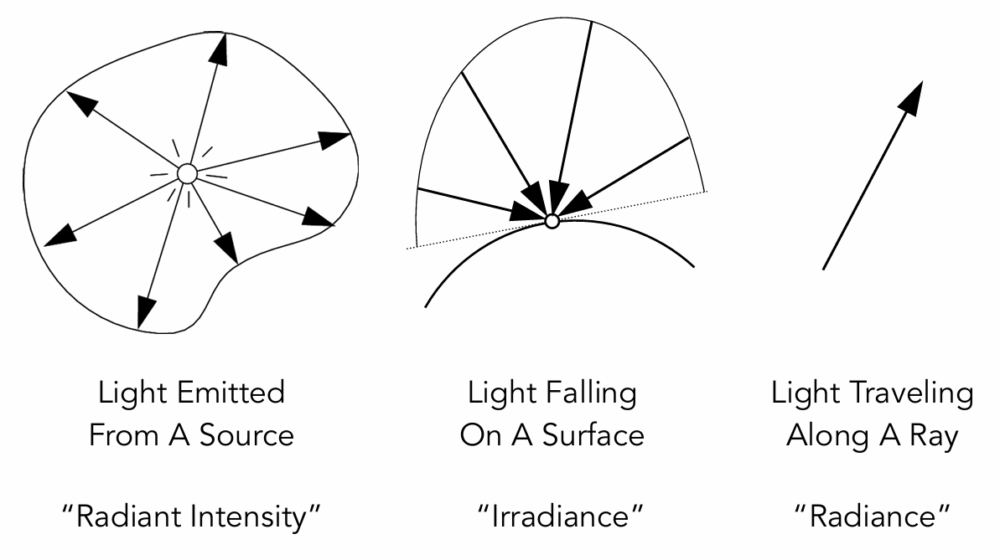
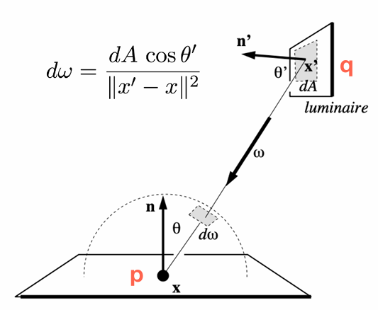
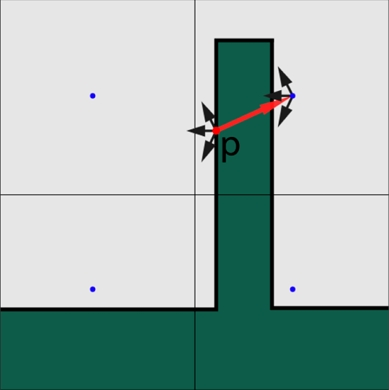
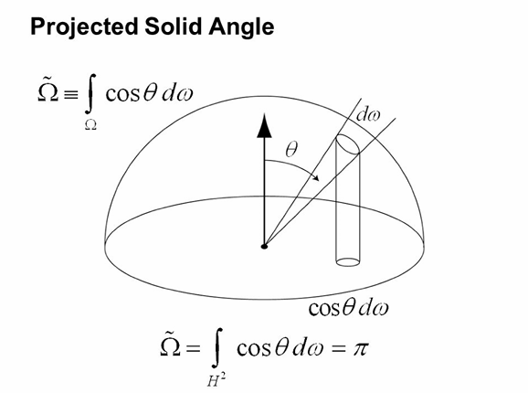
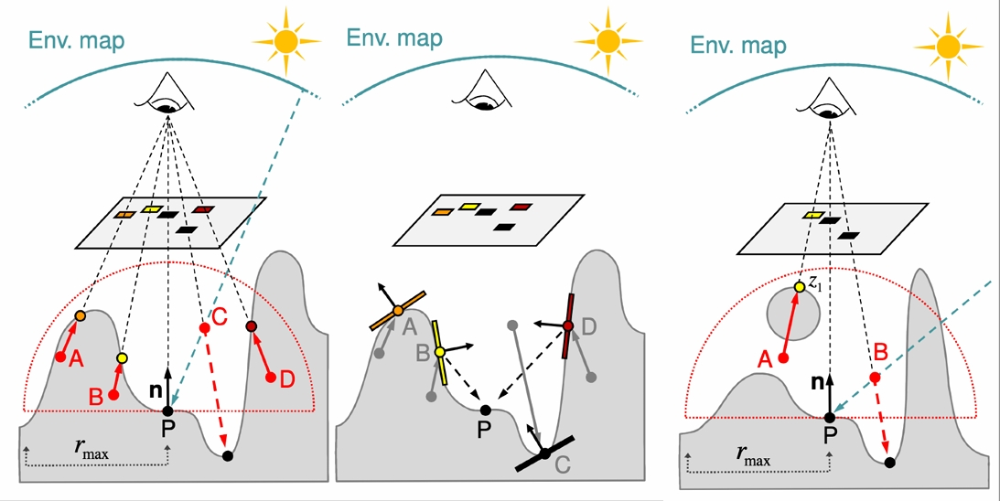

# 引

PRT 算是环境光照和全局光照之间的一个技术

直接光照已经有很多技术可以在各种场合解决了，但是全局光照的重点是间接光照，即光线反弹不止一次后进入视点的效果。人们希望能够有一种简单快速的解决方案去计算间接光照，尤其是一次反弹的间接光照。

直接光照的物体会反射一部分光，将直接光照的物体视为次级光源（相对于真正的 primary light source 而言的），它们也会产生一定的照明,这就是一次反弹的间接光照。

为了能够计算某点$p$的间接光照，需要知道如下信息：

- 被直接光照的区域/物体（Shadow Mapping 可以提供信息）

- 每个次级光源对$p$的光照贡献

---

常见解决方案分为两类

- 3D空间：RSM、VXGI

- 屏幕空间：

如果某种方法因为 Camera Pass 记录不到而就会丢失信息，那么则认为这种方法是屏幕空间的。这种现象在图像空间常见（但绝非所有图像空间的算法一定有此问题）

# RSM

> 这块似乎是参考了《Reflective Shadow Maps》这个论文，可以看一下作为补充

## Basic Idea

Reflective Shadow Maps (RSMs) 是一种用于增强3D场景中的间接光照效果的技术。其核心思想是通过 Shadow Mapping 来存储场景中光源的直接光照信息，并利用这些信息来计算间接光照。但是与传统 Shadow Mapping 不同的是，RSMs 存储的信息更加丰富，包括深度（用于阴影计算）与光源的直接光照贡献（如颜色、法线等）

相当于认为 Shadow Maps 中的每个纹素都可能是一个次级光源，不过一个明显的问题是只知道每个次级光源对摄像机方向的 Radiance，但是实际计算需要的是每个次级光源到场景中需要计算间接光照的某点$p$的方向。

如果表面假设是 diffuse 的话，相当于各个方向出射的 Radiance 是一样的，因此可以适当化简。

## Terms Explaination

Games 101 中关于辐射度量学的术语说明如下：



- Radiant Intensity（辐射强度）：光源在单位立体角内发射的辐射通量（能量）

- Irradiance（辐照度）：单位面积上接收到的辐射通量（能量）

- Radiance（辐射亮度）：单位立体角内，单位投影面积上发射或接收的辐射通量

## 立体角积分与渲染方程

$$
d\omega = \frac{dA\cos \theta '}{||x'-x||^2}
$$

上述公式是立体角的几何定义，能够把单位立体角$\omega$同微小面积$A$的联系在一起，其原理如下图所示：



针对产生间接光照的次级光源$q$，因为其信息记录在 RSMs 中，通常由一个纹素表示一小块区域的信息，因此对于一个 shading point $p$，需要从次级光源的微小面积转换为它的立体角，然后才能完成点$p$处的渲染方程求解。

原本渲染方程是这样的

$$
L(p,\omega_o) = \int_{\Omega_{patch}} = L_i(p,\omega_i) V(p,\omega_i)f_r(p,\omega_i,\omega_o)\cos\theta_id\omega_i
$$

然后从对立体角的积分转变为对微小区域的积分:

$$
L(p,\omega_o) = \int_{A_{patch}} = L_i(p\to q) V(p,\omega_i)f_r(p,p\to q,\omega_o)\frac{\cos\theta_p\cos\theta_q}{||q-p||^2}dA
$$

如果$A$足够小直接取其面积而不用积分即可，此外区域$A$的性质通常直接取样区域内一点来代替。

由此可以看出 RSM 的本质是<mark>在图像空间（就是 Shadow Map）上做计算</mark>

上述方程的关键在于解出$q$点到$p$点的 radiance，也就是$L_i$。关于$q$点的情况是这样的：

- 如果$q$点是 diffuse 的，其$f_r=\frac{\rho}{\pi}$，其中$\rho$是反射率（albedo）

- $L_i = f_r\frac{\Phi}{dA}$，而$\frac{\Phi}{dA}$构成了入射的 irradiance，它由辐射通量（Flux）$\Phi$除以区域面积得到

- $V$项一般对于间接光照就不算了，开销太大

---

$E$表示的是入射光在单位面积上的光通量 irradiance，对应渲染方程中入射光的光照贡献：$L(x,\omega_i)·\cos\theta_i$

而$\Phi = \int EdA$，是单位面积上接收到的光通量，也可以写为$E = \frac{d\Phi}{dA}$

基于此，结合上述公式化简，可以求得次级光源$q$对 shading point $p$ 所贡献的入射 irradiance：

$$
E_p(x, n) = \Phi_p \frac{\max\{0, \langle n_p | x - x_p \rangle\} \max\{0, \langle n | x_p - x \rangle\}}{\|x - x_p\|^4}
$$

如果带回上面的渲染方程的话能够消除$dA$项，实际上只需和剩下的$p$处的 BRDF 积分即可

> Lecture 7 1h27min 吃键盘预告环节

原论文公式中的分母是四次方，但闫老师认为上式分母应当是二次方，并声称错了吃键盘。就结论而言两人都没错，但是键盘也确实吃了。

## 性能与优化

优点没啥说的，就是易于实现。缺点结合优化来看：

RSM 中并非所有的 pixel 都可以参与贡献间接光照，因此可以依据经验做些简化如下

- Visibility：由于非常难算次级光源到 shading point 的可见性，通常一概认为可见

- Orientation：例如某个能够成为次级光源的点$q$的法线完全不能把光反射到$q \to p$方向，那就不使之参与计算

- Distance：距离足够近的次级光源才能够贡献出较为显著的效果，远处的干脆就不去计算了。

如何确定"足够近"？这个概念显然是世界坐标的比较。

但是论文中的做法是认为那些在 Shadow Map 中离得足够近的点在世界坐标上也离得足够近。然后在 Shadow Map 某点周围做稀疏采样或者随机采样，以避免完整采样带来的巨额计算。同时可以在近处采样多点，远处采样少点。并且由于远处采样数目减少，实际上会将多个像素的贡献当成一个，因此可以适当加大远处采样点的权重

如果一个 shadow map 是 512 大小的，那么原本单个点的计算量是

---

一些弊端：

- RSMs 的性能是和光源数目呈反比例关系

- 由于忽略了$V$项，即次级光源到 shading point 的遮挡，其效果仍旧不算太真实

- 本质上是采样率和质量的 trade off

## VPL Similarity

离线渲染中有一个重要的概念叫做Virtual Point Light (VPL)，其核心思想是将间接光照效果分解为多个虚拟点光源，每个点光源代表场景中某点的光照贡献。

而 RSM 的思想和 VPL 十分接近，可以看作是一种光栅化版本的 VPL。更广义一点来说，VPL 在离线渲染中属于一个更加广义的方法，即 Instant Radio

# LPV

> LPV is voxel-based, but isn't VXGI

Light Propagation Volumes 最早是在 CryEngine 3 中引入的，具有快速、效果好的性质，支持动态光源与动态场景。其缺点是精度有限且主要针对漫反射光照。

LPV 建立在 RSM 的基础上，核心思想是将场景中的间接光照信息存储在三维网格（体素）中，在渲染的时候直接对体素信息进行采样来计算间接光照。这解决了各个方向到达 shading point 的间接光照 radiance 的查询问题。本质上各个各自存的都是 Light Transport

注意这是实时的方法，每帧都要计算的。

## Steps

1. 照常渲染 RSM

2. 注入：将直接光照的结果注入到三维体素网格中，作为初始的光能分布，体素中记录光照信息的方式是 SH，用2阶就够了。

3. 传播：然后通过迭代的方式，将光能从每个体素传播到相邻的体素，模拟光能在场景中的扩散和反射，从而实现间接光照的信息计算。

4. 渲染：找到 shading point 对应的体素查询信息进行渲染

注意：传播的过程中仍类似 RSM 假设没有遮挡。传播不会发生在斜对角，因为可以向量分解为水平和垂直，本质也会传播到斜对角。

## Problem



体素划分大小不合适导致产生 Light Leaking 问题，比如上图右侧那个点其实不应当使用来自 p 点产生的间接光照信息。可以使用大小自适应的体素网格解决这个问题，或者称为Cascade层级网格

## Next Step of LPV

为了克服 LPV 的局限性，研究者提出了一些改进方法：

- Cascaded Light Propagation Volumes (CLPV)：通过使用多级体素网格（类似级联阴影映射）来提高光照精度。

- Voxel Global Illumination (VXGI)：基于体素的全局光照技术，能够更好地处理镜面反射和细节光照。

- Screen Space Global Illumination (SSGI)：结合屏幕空间技术，进一步提高光照效果和性能。

# VXGI

## Basic Idea

VXGI 是一种 2-pass 的算法。

VXGI 的场景被格子表示（就像乐高或者我的世界一样），然后被组织成树形结构（格子是有小有大的）。

在 LPV 中次级光源是 Texel，但是在 VXGI 中次级光源是格子。在 LPV 中光照是根据直接光照去传播的，但是在 VXGI 中，专门用 pass 2 去做反向的追踪，根据 camera ray 命中的格子（或者说 shading point）记录的信息做反向的圆锥追踪（Cone Tracing）。这一看开销就不小，当然实际上存在优化的空间。

关于这个圆锥追踪的问题，是根据微表面理论得出的。大家都知道表面分三种情况：

- Specular：此时就是镜面，单一光线追踪（Ray Tracing）即可

- Glossy 表面：圆锥追踪，camera ray 被 glossy 物体反射之后就是圆锥形，粗糙度越低，圆锥的角度越小

- Diffuse 表面：半球追踪或覆盖半球的多个圆锥追踪，因为它反射光线是在所有方向上均匀分布的

## Steps

第一个 pass 是普通的 light pass，计算直接光照。但是要为每个格子写入 pass 2 用到的数据：即这个格子的出射分布。在一些文章中这个 pass 也被称为 voxelization pass

内容包括 voxel 覆盖的区域的平均法线、材质属性和直接光照信息。利用这些信息可以得到其出射方向。

pass 2 在确定好方向和圆锥角度之后做圆锥追踪了。沿着方向进行步进，在每一个步进点上对场景信息进行采样。如果体素对圆锥有相交就计算其贡献，那么这一步的关键问题就在于如何确定哪些体素同圆锥有相交，虽然把场景中的体素都检测一边在理论上可行，但是实际上开销并不能被接受。

在实际应用中会在不同的 Mipmap 层级（相当于不同大小的体素中查找，随着步进距离的增加，其公式如下：

$$
lv = \log_2(d \div VoxelSize)
$$

其中$d$是圆锥的直径，可使用$\tan$算出来，voxelSize 是最小的体素的尺寸（世界坐标系下）

对于任意一个步进点，其查找范围是步进点为中心，两倍圆锥半径（即$d$）为边长的轴对齐正方体。范围内覆盖到的所有体素，即某个 mipmap 层级下 trace 到的范围内的每个 texel，都会查看有没有出射的 Radiance，将之累加起来作为对该 shading point 的贡献。

如何判断一个 texel 能否参与贡献<u>步进点的间接光照值</u>？

1. 上面找到的正方体范围已经筛选了一部分了

2. 方向要大致一致（点积）：$w_{direction} = \max\{N·D\}$其中N是体素法线，D是步进方向的反方向

3. 遮挡系数$w_{occlusion}$：粗略版本似乎也可以不做这个

最终的权重是：$w=w_{occlusion}·w_{direction}$

注意：shading point 看的是步进点的贡献，而步进点看的是范围内体素的贡献。

Shading point 的最终间接光照是所有步进点贡献的累加结果，步进点对 shading point 的贡献权重与步进点到 shading point 的距离有关。因为光的强度随着传播距离的增加而衰减，遵循平方反比定律

步进点看的是范围内体素的贡献，就是上面那三条。

# Screen Space Methods

## Basic Idea

Screen Space 意味着你基本上只能依靠屏幕上的信息来做运算，这几乎是后处理效果

在屏幕空间实现全局光照的技术涉及到：

- Screen Space Ambient Occlusion (SSAO)

- Screen Space Directional Occlusion (SSDO)

- Screen Space Reflection (SSR)

## SSAO

主要就是处理 contact shadow 的，一共就三步：

1. 屏幕空间坐标重建

2. 法向半球随机采样计算遮蔽值

3. 模糊处理结果

反射光通常都是从一个有限的距离过来的，所以我们需要检测一个范围内的遮挡情况（这个范围自然不能是无限大），也就半径固定的法线半球。当然远处的间接光照也可能存在，在这里就被忽略了

为什么是法向半球而不是整个球？因为大多数情况后面半个球总有很多采样是认为不通过（存在遮挡）的，但是实际上它并不会对计算 AO 有什么贡献。只是早期提出 SSAO 的时代没有手段获得某点法线，所以它考虑使用整个球做测试，但是此时会在采样 fail 的样本数目过半的情况下才会开始考虑 AO，显然这也没考虑$\cos$项加权。

当然现在是有 G-Buffer 之类的辅助手段的。所以在法线半球做，而且就可以做$\cos$加权平均了。

主要好处就是屏幕空间的计算开销肯定比整个全局空间的要小。

<mark>实际操作</mark>：

采样肯定是样本数越多越好，但是采样多了开销也大，所以会用较低的采样数目后处理模糊一下。

其实也没讲多少细节，比如说屏幕空间坐标重建、蓝噪声随机方向

---

<mark>核心理念</mark>：

认为间接光照是常数，就类似于 blinn-phong 模型背光面也不是全黑的，它认为始终存在一个常数环境光。但是每个点并不都是能从四面八方接收到这个间接光照的，因为四周存在遮挡的情况，这就造成了明暗差异。此外 SSAO 还假设材质是 diffuse 的。

理论支撑还是从渲染方程推导，首先是原方程：

$$
L_o(p,\omega_o) = \int_{\Omega^+}L_i(p,\omega_i)f_r(p,\omega_i,\omega_o) V(p,\omega_i) \cos \theta_i d\omega_i
$$

然后是 PRT 那节的约等式：

$$
\int _{\Omega}f(x)g(x)dx \approx \frac{\int_{\Omega_G}f(x)dx}{\int_{\Omega_G}dx}·\int_{\Omega}g(x)dx
$$

对于 SSAO 的计算，我们在考虑任何一点的 visibility，因此可以把该项拆出来（应用上方的公式），将渲染方程化简为这样：

$$
L_o(p,w_o)\approx \frac{\int_{\Omega^+}V(p,\omega_i)\cos\theta_i d\omega_i}{\int_{\Omega^+}\cos\theta_i d\omega_i}·\int_{\Omega^+}L_i(p,\omega_i)f_r(p,\omega_i,\omega_o)\cos\theta_id\omega_i
$$

其中

$$
\frac{\int_{\Omega^+}V(p,\omega_i)\cos\theta_i d\omega_i}{\int_{\Omega^+}\cos\theta_i d\omega_i} \triangleq k_A =\frac{\int_{\Omega^+}V(p,\omega_i)\cos\theta_i d\omega_i}{\pi}
$$

相当于任何一个点想四面八方看向外侧，其可见性加权平均（权是$\cos\theta$）

右边那项的$L_i$作为间接光照输入是常数，物体假设是 diffuse 的所以也是常数，相当于有：

$$
\int_{\Omega^+}L_i(p,\omega_i)f_r(p,\omega_i,\omega_o)\cos\theta_id\omega_i = L_i(p)·\frac{\rho}{\pi}·\pi =L_i(p)·\rho
$$

然后物体间接光照输入和 diffuse 都是自己定义的，也就是说该式子整体变成了一个自己定义的数，作为类似于 AO 强度之类的常数参数。

---

那么$k_A$项的$\cos\theta_i$哪来的？



$\cos\theta_i \mathrm{d}\omega_i$可以视为对立体角的投影。立体角将之投影到一个平面上，如果变换区域（换元）可以把它视为一个整体。

原来相当于带着$\cos\theta$在立体角上积分，变成了不带$\cos\theta$在投影的单位圆上积分

---

<mark>深入理解1</mark>：

$$
\int_\Omega f(x)g(x)\,\mathrm{d}x \approx \frac{\int_{\Omega_G}f(x)dx}{\int_{\Omega_G}dx}·\int_\Omega g(x)dx = \overline{f(x)}·\int_\Omega g(x)dx
$$

本质上相当于求$G(x)$覆盖范围内$f(x)$平均值

<mark>深入理解2</mark>：

由于已知$V$和$f_r$均为常数，其实直接从渲染方程中提出即可得到下式

$$
\frac\rho\pi·L_i(p)·\int_{\Omega^+}V(p,\omega_i)\cos\theta_i\,\mathrm d \omega_i
$$

## SSDO

Screen Space Directional Occlusion 是对 SSAO 的一种改进，其核心思想是利用屏幕空间中的深度和法线信息来计算计算光线在场景中的传播路径及其被遮挡的情况，从而生成更真实的间接光照和阴影效果。

能够提供间接光照的自然是次级光源，根据之前 RSM 的知识，间接光源是能知道的。但是并实际上实现的时候并不是从 RSM 中得到次级光源的信息，而是从屏幕（听起来有点废话，但是从 RSM 得到信息的话就不算屏幕空间方法了）

SSAO 和 SSDO 的假设正好相反。他们都从 shading point $p$ 向四周发射射线检测遮挡，但是 SSAO 认为遮挡的射线意味着无法接受来自远处的环境光，而那些未检测到遮挡的射线，则可以接收到环境光；SSDO 正相反，它认为恰恰是能遮挡射线的位置可以作为次级光源对$p$进行照亮，未被遮挡住的射线反而无法成为场景中的物体（次级光源）弹射光线的光路。

相当于 SSAO 认为间接光照来自非常远的地方，并且是均一的，SSDO 认为间接光照来自非常近的地方，于近处的次级光源的性质有关。理论上说二者都少考虑了一部分，如果把两个都实现了相对来说才是比较正确的。

---

然后从渲染方程看一下原理：

$$
L_o^{dir}(p,\omega_o)=\int_{\Omega^+,V=1}L_i^{dir}(p,\omega_i)f_r(p,\omega_i,\omega_o\cos\theta_i\mathrm d\omega_i)
$$

其中$V=1$表示射线可见（未被遮挡），$L^{dir}$表示直接光照

$$
L_o^{indir}(p,\omega_o)=\int_{\Omega^+,V=0}L_i^{indir}(p,\omega_i)f_r(p,\omega_i,\omega_o\cos\theta_i\mathrm d\omega_i)
$$

当然实际实现的时候会有一个代替，因为并不想实际地 trace 一根光线：以下图左P点到A点为例，理论上应该看P点到A点之间有没有被遮挡住，但是实际实现的时候是看相机到A点有没有被遮挡住（类似于之前的 AO 的理论）。显然A、B、D三点是比相机记录的深度更深，因此算是被遮挡。如果采样点被遮挡，参与后续计算的值实际上是采样点到相机方向上离摄像机最近的表面，即A、B、D上红色箭头指向的点。



关于计算某点对 Shading point 的贡献，需要用到三方面的数据：某点的法线、位置和颜色。位置可以由深度信息进行世界坐标重建得到。

上右图展示了一种情况导致 SSDO 出现错误，即P到A其实并未被遮挡，但是却由于A到摄像机存在几何体导致被判定为遮挡，此时产生了错误的计算

---

好处是较为接近离线渲染了

问题：

- 只能解决小范围内的全局光照（和法向半球的半径有关，稍微远一点的几何体可能就无法贡献间接光照过来）

- 仍旧丢失了相机看不见的表面的信息（及其造成的间接光照）：看不见的表面就不会产生 SSDO 的效果

## SSR

Screen Space Reflection，技术本质是在屏幕空间做光线追踪。

主要的任务：

- 任意光线和场景的求交

- 交点对 shading poing 的贡献

主要过程：

1. 对于每个 shading point，根据其法线信息和视角方向，计算反射光线的方向，公式$R = 2·(N·V)·N-V$

2. 沿反射方向光线步进，每次步进都要判断是否和场景相交，直到相交、超出屏幕范围或者达到最大步数
   
   - 相交：从颜色缓冲区采样
   
   - 不相交：环境贴图或其他后备方案

3. 反射结果后处理：双边滤波降噪

<mark>加速求交</mark>：

使用 MipMap 深度，对于上一级记录对应区域内离摄像机最近的值。做步进的时候，如果其值比某级 Mipmap 的都近于摄像机，那么相当于这块区域没有任何一个点会和步进光线相交。反之若某级 Mipmap 比光线步进的点要近于摄像机，那么则说明区域内存在点。

相当于最开始查询 Mipmap 等级最低（0级是分辨率最高的纹理），对于每次步进后的查询，如果当前 Mipmap 等级查询通过（没有命中场景），那么下次查询所在的 Mipmap 等级增加，反之减少。

```python
mip = 0
# 相当于每次都走一个格子，但是肯定mipmap 级别高的情况下走过的范围
while level > -1:
    step through current cell
    if above z plane:
        level++
    if below z plane:
        level--
```

---

SSR着色：本身的光照 + 追踪到的点的颜色

$$
L_o(p,\omega_o) = \int_{\Omega}L_i(p,\omega_i)f_r(p,\omega_i,\omega_o)cos\theta_i d\omega +f_r(p,\omega_r,\omega_o)L_{SSR}(p,\omega_r)
$$

后面那个实际上就是追踪到的点的贡献，那个点的 BRDF 乘以其颜色。当然这里<mark>潜在假设反射物是 Diffuse 的</mark>。

反射物的情况讨论完，接下来讨论 shading point 的情况，它对场景采样的行为是有影响的：

- specular：一根光线就行

- glossy：类似 specular，但是蒙特卡洛多采样几根光线

- diffuse：这玩意搞不了，它得是半球，但是屏幕空间信息就是有缺失的。

---

额外地：Light Sampling 是基于光源的分布进行采样。它的目标是直接对光源采样，生成从着色点到光源的光线方向。BRDF Sampling 是基于材质的反射特性进行采样。它的目标是根据 BRDF 的重要性分布，生成与材质反射特性匹配的光线方向。

顾名思义，二者的区别在于前者的采样是针对光源的，结合渲染方程来看：

$$
L_o(\mathbf{x}, \omega_o) \approx \frac{1}{N} \sum_{j=1}^{N} \frac{f_r(\mathbf{x}, \omega_j, \omega_o) L_i(\mathbf{x}, \omega_j) \cos\theta_j}{p(\omega_j)}
$$

因为渲染方程是没有解析解的，所以会离散化采样（蒙特卡洛方法）去近似一个解。上式的分母就表示了一次采样的结果，但是采样的方向$\omega_j$是要由概率密度函数$p(\omega_j)$决定的，相当于这个函数随机生成了采样方向。如果这个函数是基于 BRDF 的，则是 BRDF Sampling，另一种情况同理。

BRDF Sampling 本身不涉及平方衰减。SSR 的渲染方程中，对反射部分的渲染属于 BRDF Sampling。

---

优点：

- 速度快且质量好，但是仅限glossy与specular

- 没有 spikes 尖点问题

老生常谈的缺点：

- 只能反射屏幕空间内的（一些物体的底部相机看不到，就不会被地板反射）

- 屏幕边缘信息的缺失：例如一块物体A本应该都能被地板反射，但是由于A并未全部显示在屏幕上，导致A只有在屏幕里的那部分被反射看见。当然可以通过按距离衰减

- 来自光线步进的性能开销

- 对 diffuse 的表面不高效

改良：

- BRDF 重要性采样

---

屏幕空间反射中的自然特殊现象也是可以模拟的

- Sharp and blurry reflection：Glossy物体反射的模糊现象

- Contact hardening

- Specular elongation

- Per-piex roughness and normal

# Reference

[zhihu - 【论文复现】Reflective Shadow Maps](https://zhuanlan.zhihu.com/p/357259069)

[zhihu - 一文搞懂Voxel Global Illumination(VXGI)算法及其实现细节](https://zhuanlan.zhihu.com/p/691114313)

[zhihu - games202 学习笔记：实时全局光照（L7&L8&L9）](https://zhuanlan.zhihu.com/p/550382022)
