# 引

基于物理的渲染并不仅限于材质，光源、光线传输都在此范畴，只是在实时渲染里狭义上指的是材质。

实时渲染并没有很多新理论，很多都是复用离线渲染，但是由于实时性的要求，会作很多 hack，毕竟实时渲染是在保证速度的前提下才会尽可能地去追求质量（所以其实很多技术已经不是基于物理的了）

所以较之于离线渲染，实时渲染中的 PBR 质量和准确度是稍差的，典型的例子就是头发。

---

实时渲染中的 PBR 材质又分两种：

- Surface
  - Microfacet BRDF
  - Disney Principled BRDF
- Volume：头发、皮肤都属于此范畴

Disney Principled BRDF 这个东西用过 Blender 的都知道。本来这个就是设计用于离线渲染的，只是因为计算量级不大，所以可以在实时渲染里用。

然后他分了两讲，Lec 10 讲 Microfacet BRDF，Lec 11 讲 Disney Principled BRDF

# Microfacet BRDF

## Intro

> 这部分可以额外看一下 Games101 Lecture17 43:24 处开始的内容

微表面模型的的思想是将宏观粗糙表面视为由大量微小、理想光滑的微平面（microfacets）组成的集合，这些微平面具有不同的朝向，其分布由一个概率密度函数（Normal Distribution Function, NDF）描述。光线的反射不是直接由宏观表面决定，而是由这些微平面的反射累积而成。

这样的表面在近处看，即 micro surface，是 bumpy & specular

但是在足够远的地方，即 macro surface 通常认为是 flat & rough

每个微表面有自己的法线，一个区域微表面法线方向决定了材质特性

- 方向相差不远，在宏观上他们就集中于某个方向，此时就是glossy的
- 方向相差很大，在宏观上会像四面八方反射，此时就是diffuse的

相应的BRDF公式是这样的：

$$
f(i,o) = \frac{F(i,h)·G(i,o,h)·D(h)}{4(n,i)(n,o)}
$$

其中：

- $h$是半向量，为入射向量i和出射向量o的角平分线方向的单位向量，`h = normalize(i + o)`，只有这个方向才能把入射光反射到指定的出射方向
- $F$是菲涅尔项（Fresnel term）
- $G$是几何项，称之为 Shadowing-masking term
- $D$是法线分布函数 (Normal Distribution Function, NDF)，描述了微平面法线方向 $h$ 的概率分布，这个跟正态分布没任何关系
- $(n,i)$表示入射方向 i 与宏观表面法线 n 的点积，即入射角的余弦值
- $(n, o)$表示出射方向 o 与宏观表面法线 n 的点积，即出射角的余弦值

分母这部分属于实现归一化的项

---

<mark>为什么要引入菲涅尔项</mark>：

掠射角是入射角的余角，表示光线与表面之间的角度。光线越接近掠射角时，意味着它越接近平行于表面射入。

掠射角接近 0 度时，表面的反射率会增加，这意味着更多的光线会被反射

<mark>为什么要引入半程向量</mark>：

针对一片微表面构成的区域，要查询给定的 i 究竟有多少能反射到给定的 o 上。只有从半程向量这个角度的微表面才会反射到 o 方向上，这意味着需要查询的是这片区域有多少微表面法线是 h 这个方向的。

<mark>几何项解决了什么问题</mark>：

该项也叫shadowing-masking term。在一片区域的微表面中，必然存在某些微表面在光线入射的时候挡住了另一些，这时候微表面会自己产生微小的阴影（自遮挡/自投影）。从能量的角度，也就是说有一些能量没反射出来。

在入射角度几乎和宏观表面平着的时候，容易发生自遮挡。这个角度称之为Grazing angle，掠射角。

> 微表面模型是一种统称，在这个思想下有很多具体的实现，如Cook-Torrance

## Fresnel Term

一言以蔽之：使用 Schlick's approximation 可以进行估计

### 折射与反射

当一束光线命中两种介质的交界面时会发生两件事：反射与折射

折射部分可以通过Snell's Law（斯涅尔定律）知悉：

$$
\frac{\sin \theta_1}{\sin \theta_2} = \frac{n_2}{n_1} = \frac{v_1}{v_2}
$$

其中：

- $θ_1​$ 是入射角（光线与第一种介质表面法线的夹角）
- $θ_2$​ 是折射角（光线与第二种介质表面法线的夹角）
- $n_1$​ 是第一种介质的折射率
- $n_2$​ 是第二种介质的折射率
- $v_1​$ 是光在第一种介质中的速度
- $v_2$​ 是光在第二种介质中的速度

当然折射率 $n$ 是光在真空中的速度 $c$ 与光在该介质中的速度 $v$ 之比。

但是又多少光被反射和有多少被折射是仍不知道的，这需要由Fresnel Equations确定。

### 折射与反射的比例

> Fresnel Equations确定了入射光被反射和折射的比例

菲涅尔方程区分了两种偏振状态的光:

- s偏振（s-polarization）：电场垂直于入射面的光。
- p偏振（p-polarization）：电场平行于入射面的光。

就结论而言，Fresnel Equation给出了反射系数和折射系数的定义式。这里有必要区分的是，反射系数$r$不等于反射率$R$（当然折射也同理）

$$
R = |r|^2
$$

- 反射系数描述的是反射波的振幅和相位变化。
- 反射率描述的是反射光的能量比例。

---

<mark>反射系数的公式</mark>如下：

$$
r_s = \frac{n_1 \cos \theta_i - n_2 \cos \theta_t}{n_1 \cos \theta_i + n_2 \cos \theta_t}
$$

$$
r_p = \frac{n_2 \cos \theta_i - n_1 \cos \theta_t}{n_2 \cos \theta_i + n_1 \cos \theta_t}
$$

其中：

- $n_1$​ 是第一种介质的折射率
- $n_2$​ 是第二种介质的折射率
- $θ_i​$ 是入射角
- $θ_t​$ 是折射角，可以通过 Snell 定律计算得到：$n_1​ \sin{\theta_i}​=n_2 ​\sin{\theta_t}​$

由于图形学中考虑的光通常是无偏振的，因此二者是等量的，故可取其平均值，因而无偏振光的反射率有：

$$
R = \frac{|r_s|^2 + |r_p|^2}{2}
$$

其中$R \in [0,1]$，表示无偏振光反射的能量占总入射光能量的比例。而入射光的能量，就构成了Render Equation的Lighting项$L_i$

$$
L_o(x, w_o) = L_e(x, w_o) + ∫ L_i(x, w_i) * f_r(x, w_i, w_o) * cosθ * dw_i
$$

---

<mark>透射系数的公式</mark>如下：

$$
t_s = \frac{2 n_1 \cos \theta_i}{n_1 \cos \theta_i + n_2 \cos \theta_t}
$$

$$
t_p = \frac{2 n_1 \cos \theta_i}{n_2 \cos \theta_i + n_1 \cos \theta_t}
$$

透射率$T$通常不等于$|t|^2$，而是而外地带有修正因子。在一些特殊情况下可以近似地认为$T \approx |t|^2$

并且因为存在介质的吸收与散射，通常情况下$R+T<1$。

### Schlick's Approximation

$$
R(θ) = R_0 + (1 - R_0) * (1 - cosθ)^5
$$

$$
R_0 = ((n_1 - n_2) / (n_1 + n_2))^2
$$

其中：

- $R(θ)$ 是入射角为 $θ$ 时的反射率。
- $R_0$是垂直入射（θ = 0）时的反射率，也称为基础反射率
- $n_1$ 是光线最初传播的介质的折射率（入射介质）
- $n_2$ 是光线将要进入的介质的折射率（透射介质）

空气一般近似地认为折射率为1

使用 Schlick 近似，相当于把 Fresnel Equation 这个具有多个参数的函数化简减少了参数个数，并且其中很多内容可以预计算，例如$(1 - \cos\theta)^5$这部分

在金属情况下似乎$R_o$是 RGB 的。


## NDF Term

不同的实现类型：

- Beckmann
- GGX：工业界最常用
- 闫老师自己研究的一些（但是不适合实时渲染）

### Beckmann NDF

Beckmann NDF 的公式是这样的：

$$
D_{\text{Beckmann}}(\mathbf{h}) = \frac{1}{\pi \alpha^2 \cos^4\theta_h} \exp\left(-\frac{\tan^2\theta_h}{\alpha^2}\right)
$$

其中：$\alpha$是粗糙度参数，0 表示非常光滑，1 表示非常粗糙。$\theta_h$是$h$与宏观法线的夹角

Beckmann NDF 是定义在坡度空间（slope space）上的，这与高斯分布有关。原来在法线半球上，通过$\theta_h$描述法线的方向，现在在坡度空间上（就是下图中最上面的横线）描述，那么$\theta_h$总和唯一一个坡度空间的长度对应（即下图中的$\tan\theta$），并且避免了出现面朝下的微表面的情况。

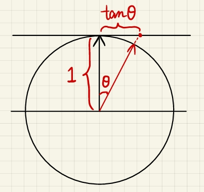

特征：

- Beckmann NDF 的高光反射形状较为尖锐，适合模拟较光滑的表面
- 涉及指数函数和三角函数，计算开销较大

### GGX NDF

GGX NDF（Trowbridge-Reitz NDF）的公式是这样的：

$$
D_{\text{GGX}}(\mathbf{h}) = \frac{\alpha^2}{\pi \cos^4\theta_h \left(\alpha^2 + \tan^2\theta_h\right)^2}
$$

GGX NDF 具有的特征最显著的特征就是 long tail。不同于 Beckmann 的衰减形式，它虽然也衰减，但是到$\pm \frac\pi 2$（掠射角）的时候它趋近于一个不为零的常数，这可以在下图看出来

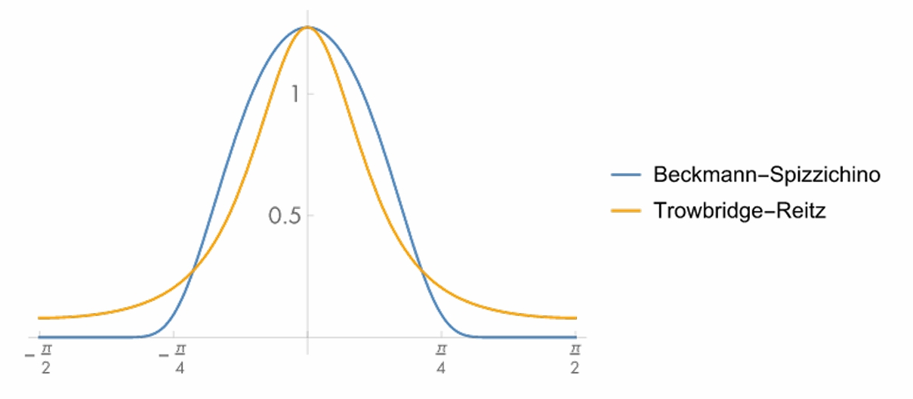

这样的衰减形式使得 GGX 的高光随着角度会减少但是不会消失（Beckmann 的高光会消失），这使得 GGX 具有这样的优于 Beckmann 的优势：
- GGX 的高光拥有逐渐衰减的光晕效果，进一步地这使得过渡到 Diffuse 更自然。
- 除了高光部分，其余部分会像 Diffuse

额外提一点就是 GGX 与实测数据匹配更好，更接近真实材质的反射行为。

### Extended GGX

就开销而言，两者开销差不多

后人在 GGX 的基础上做了改良，提出了 Extended GGX  (Generailzed Trowbridge-Reitz, GTR)

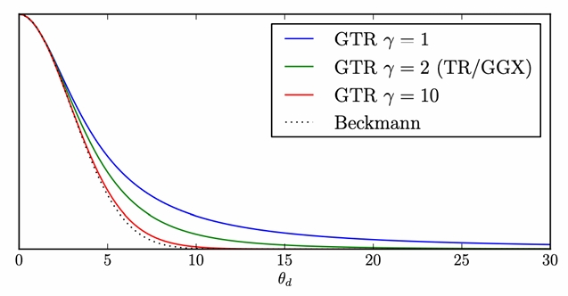

增加了参数$\gamma$控制拖尾的长度，当$\gamma = 2$时就是GGX，当$\gamma$超过 10 的时候会接近 Beckmann

## G Term

### Physical Basis

G 取自 Geometry Term 的首字母，当然前面提到了有另外一个名称叫 Shadiowing-Masking。引入这一项是考虑到微表面产生自遮挡的现象，如下图所示：

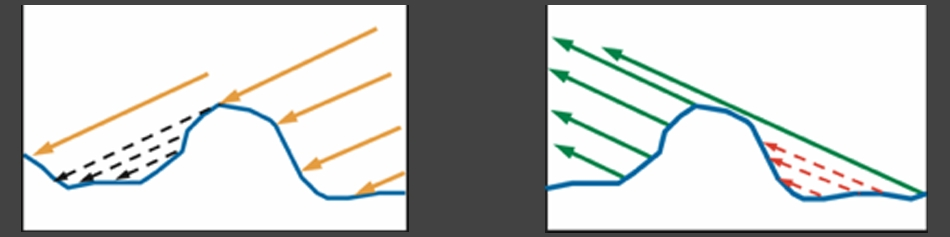

- 左图反应了 light 出发光线打不到某些位置，对应 shadow
- 右图反应了 shading point 反射的光线不能被眼睛接收到，对应 masking

如果不考虑这个，渲染出来的会比真实的要亮。特别是在掠射角的情况下，避免了极度明亮的结果。（其实主要就是抵消分母在掠射角情况下极小造成结果极大的情况）

常用的 G 项实现叫做 Smith Shadiowing-Masking Term。但是他把 Shadiowing 和 Masking 拆开考虑了（但是实际上二者是有关系的）

### Energy Loss

G 项和能量丢失也密切相关，如下图所示的白炉测试，在仅仅改变粗糙度的情况下，其实右侧比左侧暗（能量损失），按道理讲他虽然没那么 glossy，但是亮度应该是差不多的。

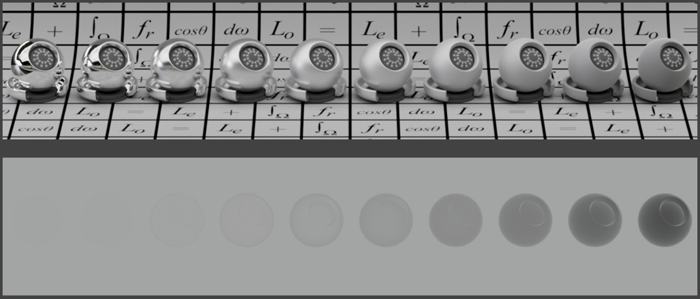

究其原因，因为粗糙的时候表面沟壑更加严重，所以一个光线打到微表面的时候他的反射光更容易被其他微表面挡住。但是 G 项只考虑的单次反射，而物理上的事实情况是单次反射被自遮挡的光线在经过多次反射之后，仍可以以漫反射的形式离开表面，形成一个更均匀、更亮的分布。

即越粗糙的表面多次弹射占比越大，进一步使得只考虑单次反射的 G 项反射出的能量小于物理事实上多次反射的，造成了显著的亮度差异。

### Fix of Energy Loss

解决方案也是不言自明的：把丢失的能量补回去。

Heitz 在 2016 年的论文中提出了一种在离线渲染中解决微表面模型能量丢失问题的方法，称为 Multiple-Scattering Microfacet Model（多次散射微表面模型）。该方法的核心思想是通过模拟光线在微表面之间的多次反射，补偿因单次反射计算导致的能量丢失问题。但是由于其过大的计算量，仍旧无法应用在实时渲染中。

在实时渲染中，通常使用近似方法来补偿能量丢失，尽管在物理准确性上不如 Heitz 的方法，但是速度上来了，效果也比没有强，工业界的典型做法就是 The Kulla-Conty Approximation。

Kulla-Conty 近似的核心思想就是“某次被遮挡则意味着会进行下次弹射”，上面已经说了，最终结果就是作为一个漫反射的形式离开表面。也就是说可以通过一种经验性的方式补全丢失的能量。

> 注意，下面提到的$E$是比例值，$E\in[0,1]$

首先要去求单次散射的情况下在方向$\mu_o$上有多少比例的能量$E(μ_o)$能出来。令$\mu_o = \cos\theta_o$为出射方向天顶角余弦，$\mu_i = \cos\theta_i$为入射方向天顶角余弦。然后还要假设$L_i = 1$，因为计算的是一个比例值。二来把它归一化了可以简化计算，实际使用的时候额外乘以光源强度即可（反过来说就是和光源强度解耦）。所以下面的式子是没有出现$L$项的。

而单次散射的情况下在方向$\mu_o$上有多少比例的能量$E(μ_o)$能出来，这本质就是一个渲染方程的反射部分，所以式子的基础结构就有了。同时为了实际能够计算半球积分$\int_{\Omega}f(\omega_i)\mathrm{d}\omega_i$，会把他进行球面坐标系展开，这是一个老生常谈的高数公式：

$$
\int_{\Omega}f(\omega_i)\mathrm{d}\omega_i = \int_0^{2\pi}\int_0^{\pi/2}f(\theta,\phi)\sin\theta \mathrm{d} \phi\mathrm{d}\theta
$$

既然是渲染方程的反射部分，那么 BRDF 肯定是乘了$\cos\theta$的，$f \cos\theta\sin\theta \mathrm{d} \theta$可以化为$f \sin\theta \mathrm{d} (\sin\theta)$，然后就可以令$\mu=\sin\theta$将$\sin\theta$换元。最终就产生了下式：

$$
E\left(\mu_{0}\right)=\int_{0}^{2 \pi} \int_{0}^{1} f\left(\mu_{0}, \mu_{i}, \phi\right) \mu_{i} \mathrm{d} \mu_{i} \mathrm{d} \phi
$$

这时候可能有疑问：BRDF 项不应该是$f(\omega_i,\omega_o)$吗？其实这两种形式可以互相转化。

那么损失的能量比例就是$1-E(\mu)$，这也是需要补充的能量比例。但是其实缺失能量可以分为在入射方向损失的和在出射方向损失的。而$E(\mu)$本身就是表示在方向$\mu$上有多少比例的能量能出来，那自然可以划分为入射和出射两种。同时补一个归一化系数$c$确保补偿后的总能量守恒，可以设计出下式（当然这只是一种情况，还可以设计成别的形式）：

$$
f_{ms}(\mu_i,\mu_o)=c\left(1-E\left(\mu_{i}\right)\right)\left(1-E\left(\mu_{o}\right)\right)
$$

他本质是个 2D BRDF，所以视作$f_{ms}(\mu_i,\mu_o)$，作为对原来单次散射的 BRDF 的补充。那么下一步就是求这个$c$，使得在这个 BRDF 上的积分为$1-E(\mu_o)$。为什么和$E(\mu_i)$又没关系了？因为上面说了“某次被遮挡则意味着会进行下次弹射”，某次的$E(\mu_i)$会在下一次的$E(\mu_o)$中做计算，所以总体损失是$1-E(\mu_o)$。最后得到下式：

$$
f_{\mathrm{ms}}\left(\mu_{0}, \mu_{i}\right)=\frac{\left(1-E\left(\mu_{0}\right)\right)\left(1-E\left(\mu_{i}\right)\right)}{\pi\left(1-E_{\text {avg }}\right)}, E_{\text {avg }}=2 \int_{0}^{1} E(\mu) \mu d \mu
$$

可以把这个式子带回原先的球面积分，很容易发现得到的结果就是期望的$1-E(\mu_o)$

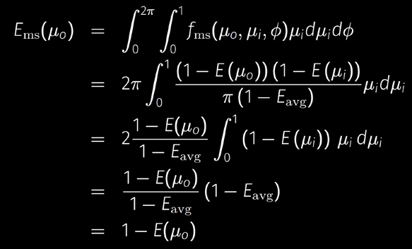

对于平均逃逸概率$E_{avg}$，该部分不存在解析解，很自然想到的方法就是预计算/打表，其参数本身就是粗糙度和$mu$，可以预计算为一张纹理。因为$E(\mu)$用到 Microfacet BRDF，里面含有粗糙度的。当然对于不同的 BRDF 其预计算的结果自然也不一样。

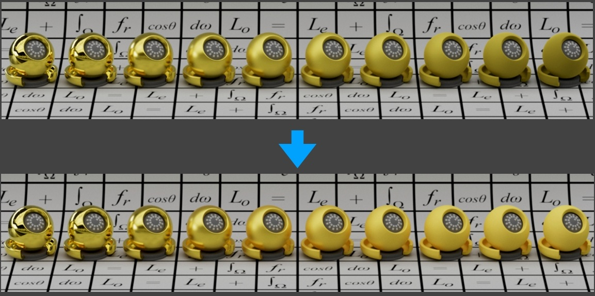

如果 BRDF 有颜色怎么办？有颜色意味着有吸收，所以意味着能量损失，所以一开始就得不到 100% 的能量反射。所以先按无颜色算，然后再考虑由于颜色引起的损失。

因此提出了$F_{avg}$表示平均每次反射。这里讲的不是很清楚，闫神的意思应该是对于各向同性介质，其反射率和$\phi$无关，仅仅由$\mu$就能确定。所以$\phi$的积分可以作为常量提出为$2\pi$，再结合之前的换元，原式可以化为：

$$
F_{total}=2\pi \int_{0}^{1} F(\mu) \mu \mathrm{d} \mu
$$

然后处于积分区域的面积得到平均值：

$$
F_{avg}=\frac{\int_{0}^{1} F(\mu) \mu \mathrm{d} \mu}{\int_{0}^{1} \mu \mathrm{d} \mu}=2 \int_{0}^{1} F(\mu) \mu \mathrm{d} \mu
$$

> 提出$F_{avg}$的原因在于，多次散射之后，光线方向趋于随机化，无法用单一角度$\theta$的菲涅尔项描述。所以期望通过一个平均化的值来进行描述反射出来的能量

但是反射出来的能量不代表能被从给定视角看到，因此还需要乘一个比例$E_{avg}$，即表示直接能看到的能量是$F_{avg} E(\mu_o)$。以此类推，经过一次反射后能看到的能量则是$F_{avg}\left(1-E_{avg}\right) \cdot F_{avg} E_{avg}$

由此推至$k$次反射后能看到的能量则是$F_{avg}^{k}\left(1-E_{a v g}\right)^{k} \cdot F_{avg} E_{avg}$，将$k$次结果相加构成无穷级数，得到如下结果：

$$
F_{ms} = \frac{F_{avg} E_{avg}}{1-F_{avg}\left(1-E_{avg}\right)}
$$
最终的应用是$F_{total} = F_{ss} + F_{ms}$构成渲染方程的 BRDF 项进行渲染，其中$F_{ss}$是只考虑了单次散射的 BRDF，即$F_{ss} = (D * G * F) / (4 * cos(\theta_v) * cos(\theta_l))$
### Combining a Microfacet BRDF with a Diffuse Lobe

在 CV 中还挺常用。但是闫神说了：完全错误。物理不正确，绝对保证不了能量守恒，在一些全局光照的情况下很可能出现某些自发光的物体。

当然除非能保证加了 diffuse 之后还能做一些修正使得能量守恒，也是说得过去的，目前有人在研究。

## Concept Discrimination

1. diffuse 和 specular 可以同时存在，前者负责漫反射，后者负责镜面反射
2. 金属的漫反射接近 0，因为光线几乎全部被吸收或反射（导电性导致）
3. 金属和非金属均有镜面反射，但金属的镜面反射强度（F0）更高且为彩色
4. Roughness 只影响 Specular，粗糙度越低微表面法线分布越集中，导致高光越锐利。而 Diffuse 是均匀反射
## Microfacet in Morden Engine

> 未经拓展的 微表面模型具有局限性，现代引擎对其做了扩展应用。

在未经拓展的情况下，Microfacet 模型通常用于模拟 specular 反射，因为模型建立的假设就是每个微表面仅仅会反射光线，此时所有光线要么被镜面反射，要么被吸收。而漫反射的本质实际上是光线在材质次表面的多次散射和吸收后重新出射的结果。

此外基础的微表面模型也没有对金属材质做处理。要使微表面模型能够准确地处理金属材质，需要特别调整菲涅尔项，必须使用基于复折射率（对，是个复数）计算的菲涅尔项，并考虑反射率和颜色随波长的变化。

---

现代引擎中的 PBR 通常采用混合模型，结合了 Microfacet BRDF 的框架与针对金属/非金属材质的扩展处理。

现代引擎只认为有“存在漫反射”和“不存在漫反射”两种情况，在`metallic=1`时漫反射被禁用。其物理依据是在真实世界中，材料只有 导体（金属） 和 绝缘体（非金属） 两类，电导特性决定了光线是否进入材质内部（产生漫反射）。

| 金属度（Metallic） | 漫反射（Diffuse） | 镜面反射（Specular）       | 物理机制                                |
| ------------- | ------------ | -------------------- | ----------------------------------- |
| **0（非金属）**    | 存在           | 弱反射（F0≈4%，如塑料）       | 光线部分反射，其余进入材质内部散射（次表面散射），形成漫反射颜色。   |
| **1（金属）**     | 不存在          | 强反射（F0=BaseColor，如金） | 自由电子立即反射几乎所有光，无次表面散射，漫反射能量趋近于0（黑色）。 |

虽然它看起来是一个`bool`值，但是实际引擎允许中间值（如0.3、0.7）的存在。对此引擎采取混合策略

```csharp
// 线性混合F0（镜面反射颜色）
vec3 F0 = mix(vec3(0.04), baseColor, metallic);

// 计算漫反射（金属度越高，漫反射越弱）
vec3 diffuse = (1.0 - metallic) * baseColor;

// 微表面高光计算（GGX分布，受粗糙度影响）
float alpha = roughness * roughness;
vec3 specular = GGX(N, V, L, alpha, F0);

// 最终颜色 = 漫反射 + 镜面反射
vec3 color = (diffuse * (1.0 - F0) + specular) * lightColor;
```

就结论而言，物理上不存在“半金属”，中间值只是艺术妥协，用于模拟复杂表面（氧化、脏污、合金等）

具体的实现我会在解析 Filament 的 PBR 的文章中进行说明。
## LTC : Shading Microfacet Models

Linearly Transformed Cosines(LTC) 是一种用于实时渲染中高效计算复杂光照（尤其是基于物理的镜面反射）的技术，由Eric Heitz、Jonathan Dupuy、Stephen Hill和David Neubelt在2016年提出。其基本思想认为一个 BRDF Lobe 可以通过某种线性变换成为一个标准的余弦 Lobe（Lambertian反射），并且这个过程可以通过逆变换还原回去。而余弦分布的积分是有解析解的，这大幅降低计算复杂度。

主要是针对 Microfacet 的 GGX 的情况，但是事实上对于 backmann 之类也可以。

他是去解决 shading 问题，但是没去解决 shadow 的问题。主要处理的就是多边形的光源，并且假设光源内部是 uniform 的，即发出的光强度均匀

一个 BRDF Lobe 变换为余弦 Lobe 的本质实际上是 Lobe 覆盖的每个方向都经过这个变换，进一步地相当于积分域也会变换。当然，多边形光源也变换，因为原先光源覆盖到 cos lobe 上是错误的。

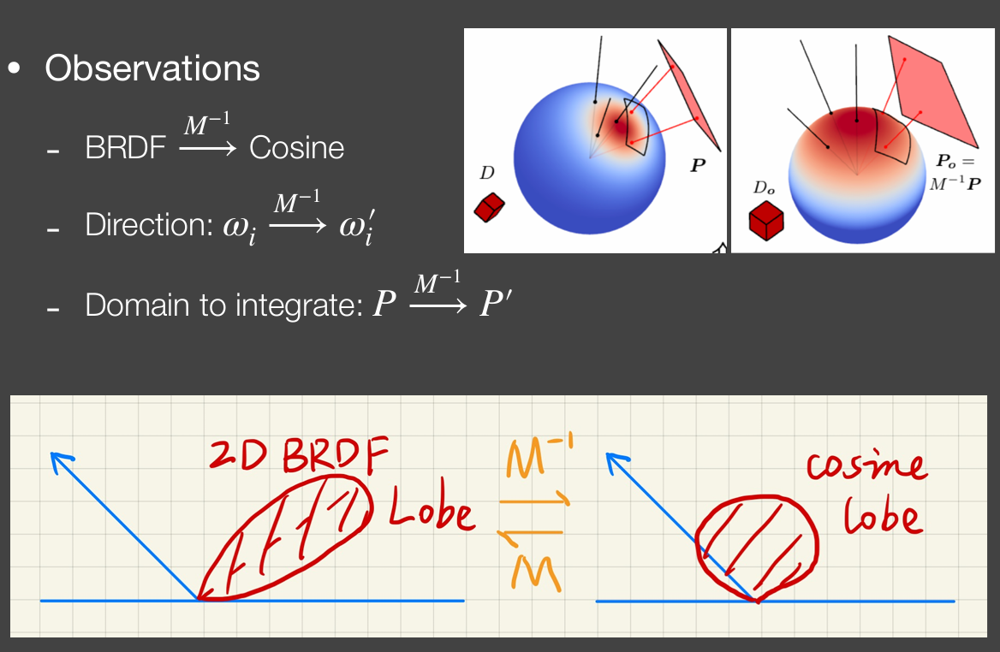

由于已经假设了光源多边形区域内部是 uniform 的，因此$L_i$是一个常数可以提出来。同时经过变换$\omega_i = \frac{M\omega_i'}{||M\omega_i'||}$可以为积分式换元

$$
\begin{aligned} L\left(\omega_{o}\right) &=L_{i} \cdot \int_{P} F\left(\omega_{i}\right) \mathrm{d} \omega_{i} \\ &=L_{i} \cdot \int_{P} \cos \left(\omega_{i}^{\prime}\right) \mathrm{d} \frac{M \omega_{i}^{\prime}}{\left\|M \omega_{i}^{\prime}\right\|} \\ &=L_{i} \cdot \int_{P^{\prime}} \cos \left(\omega_{i}^{\prime}\right) J \mathrm{~d} \omega_{i}^{\prime} \end{aligned}
$$

注意：
1. 它是把整个$f·\cos$经过变换换成了$\cos\omega_i'$，而不是仅仅变换$f$
2. $J$ 项是雅可比行列式（Jacobian Determinant）
3. 对于一个 BRDF 有多个 Lobe 的情况，需要为每个 Lobe 都分别做变换

M 是预计算的主要部分，与 BRDF 强相关，并且 LTC 理论可以处理各向异性的 BRDF。这块的东西是纯微积分计算，能够得到一个解析解，到时候在实际使用的时候查表就行。

## Q&A

Microfacet 可以表示 diffuse 吗？能量守恒的是可以的（指没有忽略多次反射的）
## Implement Details


## Cost of LTC

计算量仅取决于多边形边数，复杂度$O(N)$，且无迭代或随机性。

# Disney Principled BRDF
## Causation ：Limitations of Microfacet

提出 Disney Principled BRDF 的原因在于微表面模型的局限性。

一方面它无法表示复合/多层材质，例如在一块木头上面刷了清漆。

另一方面微表面模型并不是 artist friendly 的，其参数对于艺术家快速调节效果具有一定的理解成本（比如复数金属反射率）。当然，既然 Disney Principled BRDF 是 artist friendly 的，那么在方便性和物理事实之间就存在妥协：该模型并不要求在物理上完全正确。
## Principles

Disney Principled BRDF 的理念或者说原则一般是这样的：

1. 直观性（Intuitive）:参数应直观且易于艺术家理解，避免复杂的物理术语与参数
2. 灵活性（Flexible）：<mark>少量参数</mark>应能覆盖广泛的材质表现，从金属到非金属，从光滑到粗糙。
3. 鲁棒性（Robust）：参数组合在任何情况下都应表现合理，避免极端值下的艺术失真或数值不稳定（参数一般是 0 到 1 但是允许某些时候超出这个范围以实现特殊的着色效果）
4. 能量守恒（Energy-Conserving）

下图展示了 Disney Principled BRDF 所用到的所有参数。


上图有 10 个参数，它们独立起作用，各自控制的效果可以叠加。不过参数空间越大越容易造成冗余。
## Advantages and Disadvantages

那么结合上文，Disney Principled BRDF 的优点就是显而易见的了：

- 各个参数易于理解和使用
- 单一模型通过参数的混合组合使得可以描述出很多不同的材质
- 开源实现有很多，方便学习

那么缺点也自然是存在的：

- 不够物理（但是这也不算是大问题）
- 可能有冗余（毕竟参数那么多）

因为模型底层就变了，实际上 Disney Principled BRDF 不是很适合用于实时渲染，因为之前很多理论都是基于微表面模型推导的。而 Disney Principled BRDF 根本没那些 $F·G·D$ 项。

---

可以对比一下如果没有 Disney Principled BRDF 时，艺术家是如何调整效果的。毋庸置疑，肯定是直接调整微表面模型的参数，例如：

- 通过调整微表面的法线分布（NDF 项）控制粗糙度，进而影响高光的锐利或模糊程度
- 通过控制材质的菲涅尔反射率决定镜面高光的颜色和强度，例如非金属通常`F0=0.04f`
- 通过 BaseColor 控制漫反射的颜色。非金属的漫反射颜色来自`BaseColor`，但是金属的`BaseColor`仅用于镜面反射

然后会发现这个太乱了
## Further Reading

[Disney Principled BRDF实现笔记](https://airguanz.github.io/articles/2019.02.20.Disney-BRDF)

[PBR-White-Paper/content/part 3/README.md at master · QianMo/PBR-White-Paper](https://github.com/QianMo/PBR-White-Paper/blob/master/content/part%203/README.md)
# Non-Photorealistic Rendering

实时渲染中的 NPR 要求快速和可靠（对，说的就是神经网络的风格化实现，就不满足这两点中的某一种或者两种）

谈及 NPR 自然是要从 Photorealistic Rendering 说起，PR 强调画面的真实感，以以假乱真为目的，期望使人无法分辨是渲染出来的还是摄像照出来的，其内容的光照、阴影、材质等效果需要无限接近于真实。

而 NPR 的目的则是去制造一种 artistic 的效果，或者说风格化的艺术表达，它不要求写实，但是依旧能够通过独特的风格和特点清晰传达想要表达的内容。

就实现而言，NPR 还是要从真实渲染的结果出发，在其上去做修改。
## outline rendering

<mark>contours 并非是 outline</mark>：contours是指整个人物轮廓外围的一圈。而 contours 是 outline 的一个子集，outline 包含了：

- Boundary / border edge：物体外边界，但是这个边不可以由多个面共享
- Crease：折痕，通常是在两个表面之间的
- Material edge：材质边界
- Silhouette edge：这个必须得由多个面共享，且位于外轮廓上
（S 是 C 的子集）

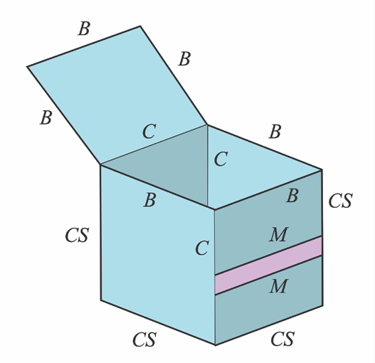

描边有两种做法：

- shading：主要解决的是绘制 Silhouette edge
- Post Processing

Shading 方式的基本思想是 shading point 的法线同观察方向几乎垂直的时候，该处就参与构成了 Silhouette edge。在实际渲染的时候通过一个判断该值是否超过一个阈值来判断一个 Shading point 是否属于某个 Silhouette edge 的范围内。不过此法有缺点是实际的模型不同位置的描边粗细可能不一样。

因此提出了另一种改进方式，即法线外扩法。当然这是一种思想，实际实现的时候会由不同的操作，例如可以把背面的面缩放变大一点，并且按轮廓线的颜色渲染。然后在本次绘制的结果上绘制没有缩放的正面。这个扩大可以说边往外推也可以是顶点往外推，这是不一样的。

基于图像的后处理就是拿到渲染的结果之后，使用卷积手段做图像处理，通常是使用 Sobel 算子。处理的图不一定是 Color Buffer，也可以是 Depth Buffer 等。

## Color Blocks

色块，老生常谈的，阈值化。推广开来可以有多个色阶构成，即 Quantization。实际上就是对结果离散为几档，每档亮度映射到一种颜色。当然即便是这样，色块的边缘依旧是硬边缘。如果期望色块的过渡也存在渐变（即平滑过渡）则使用叫做 Color Ramp的技术。

下图展示了对不同成分进行卡通着色的效果： 

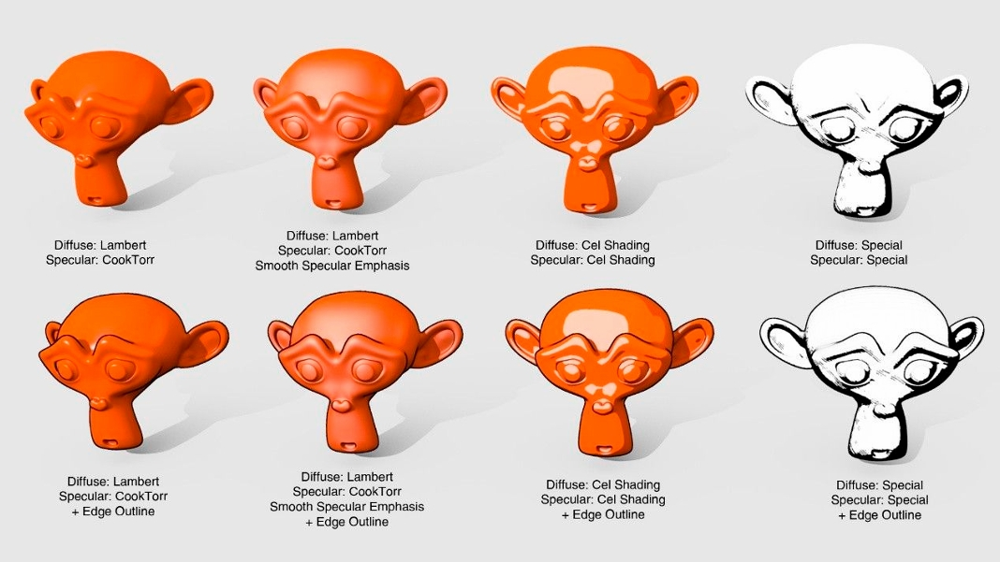
## Stroke surface stylization

其实就是如何模拟笔触，例如素描风格。

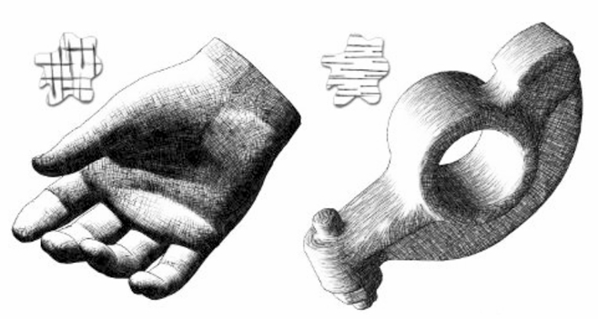

这里主要介绍了 Tonal art maps (TAMs) 方法，它的核心目标是通过预计算的色调映射，将复杂的光照效果简化为艺术化的明暗层次，从而生成类似手绘插图（如技术插图、卡通渲染或素描风格）的视觉效果。

然后进阶拓展/变体包括：
- 多维度 TAMs：不仅考虑光照强度，还可能结合视角、曲率等参数生成更动态的风格化效果。
- 纹理化 TAMs：用纹理（如笔触、纸张质感）替代纯色层级，增强手绘质感。
- 动态 TAMs：在实时渲染中根据场景动态调整色调映射（如动态光照下的卡通角色）。

课上讲的其实是纹理化 TAMs，因为它使用预先准备好的素描笔触纹理贴上去。对此需要确定这样几件事：

- 不同的点应该使用哪个密度的贴图
- 不同的点之间，密度变化的地方，笔触较为连续

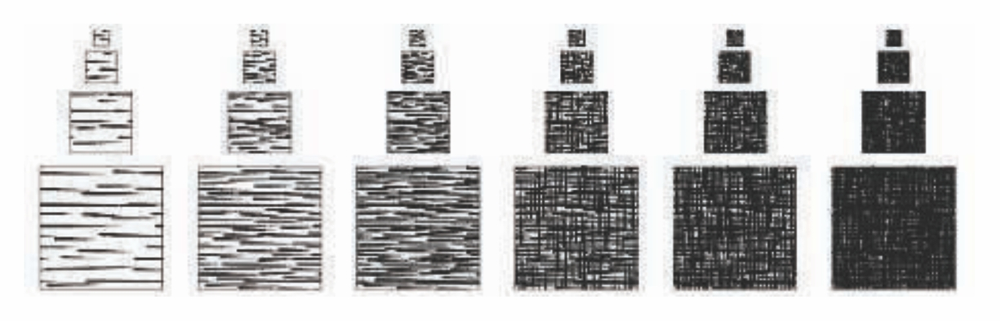

为不同密度的笔触准备贴图，每个密度的贴图都要有 MipMap，并且各级 MipMap 其密度是一样的，不可以因为缩小而变的更密集。
## NPR Summarize

NPR is art driven。需要做出什么样的效果是艺术家们决定的，作为技术人员考虑的是如何把美术黑话翻译成渲染上的技术需求，所以：沟通最重要。

此外 NPR 并不是一个对所有渲染元素都能“一把梭”的概念，在实际应用的时候，可能对不同的角色，甚至同一个角色的不同部位使用不同的 NPR 技法进行渲染。

NPR 做的效果好与坏，其实根本上取决于 photorealistic 模型，而不是后期的各种处理。在 NPR 处理之前的真实感的数据是关键的地方
# Other Things

## BRDF : Spectral or RGB

# Reference

[zhihu - GAMES202 高质量实时渲染笔记Lecture10：Real-Time Physically-Based Materials (Surface models)](https://zhuanlan.zhihu.com/p/384559264)
[zhihu - GAMES202 高质量实时渲染笔记Lecture11：Real-Time Physically-Based Materials (Surface models cont.)](https://zhuanlan.zhihu.com/p/385438367)
※ [QianMo/PBR-White-Paper: ⚡️基于物理的渲染（PBR）白皮书 | White Paper of Physically Based Rendering(PBR)](https://github.com/QianMo/PBR-White-Paper/tree/master)
