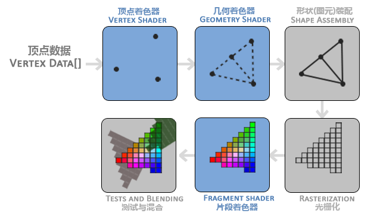

# 正式内容之前

## CLion配置OpenGL环境

1. 打开下载的GLFW源码，`设置=>构建、执行、部署=>CMake`在缓存变量一栏勾选`BUILD_SHARED_LIBS`，然后取消勾选`GLFW_BUILD_EXAMPLES`和`OFFGLFW_BUILD_TESTS`

2. 还是上面的页面中可以找到输出目录，在目录的`./src`中找到`glfw3.dll`、`libglfw3.a`和`libglfw3dll.a`，这些放在自己工程的`./lib`文件夹下

3. 在下载的源码中找到`include/GLFW`，把这个文件夹复制到自己项目的`./include`下

4. GLAD得到的两个文件夹`glad`和`KHR`复制到自己项目的`./include`下

5. GLAD得到的`glad.c`复制到自己项目的`./src`下

配置CMake文件如下，其中glfw1是项目的名字，可替换：

```cmake
cmake_minimum_required(VERSION 3.29)
project(glfw1)

set(CMAKE_CXX_STANDARD 20)

find_package(OpenGL REQUIRED)
include_directories(${OPENGL_INCLUDE_DIRS})

# 指定 include 文件夹
include_directories(
    ${PROJECT_SOURCE_DIR}/include
    ${PROJECT_SOURCE_DIR}/glfw3
)

add_executable(glfw1 src/main.cpp
        src/glad.c)

link_directories(${PROJECT_SOURCE_DIR}/lib)
target_link_libraries(glfw1 ${PROJECT_SOURCE_DIR}/lib/libglfw3.a)
```

当然，在项目资源列表对`glad.c`右键有选项直接加到CMake文件里。

>  题外话，其实好的做法是把GLFW作为子模块，独立于项目编译

## 前置概念速通

### 两种模式

核心模式：是 OpenGL 3.2 及更高版本引入的一种上下文配置方式，它与兼容性模式（Compatibility Profile）相对。因为要移除已弃用的功能、精简API和提高性能，所以不打算向以前兼容。

兼容模式：顾名思义的

### VAO、VBO、EBO与FBO

<mark>VBO</mark>：存储顶点数据的内存区域。将顶点数据（例如位置、颜色、纹理坐标等）以数组的形式存储在显存中，供 GPU 直接访问。<u>本质是字节流</u>。

<mark>VAO</mark>：需要按照固定的格式编码和解码VBO这个字节流，这就是VAO的作用。VAO定义了一个顶点含有的所有属性的总字节长度，以及按怎样的顺序解读（例如前$4*3$个字节是位置，之后$4*4$个字节是顶点色等）。并且由于一个顶点的所有属性长度是固定的，按照这个进行偏移可以读取字节流中第N个顶点的数据

<mark>EBO</mark>：就是一组顶点索引，表示绘制用到的顶点有哪些（及其顺序）。

如果没有 EBO，OpenGL 会根据 VBO 中顶点数据的顺序，按顺序将顶点组合成图元（通常是三角形）。这在处理简单几何体时可能没问题，但对于复杂几何体，这种方式可能有潜在的灵活性问题：

1. **难以表示共享顶点:**  复杂几何体通常包含许多共享顶点的面片。例如，一个立方体有8个顶点，但每个面都共享部分顶点。如果只用 VBO，每个面都需要重复存储共享顶点的坐标数据，导致<u>数据冗余</u>，浪费内存和带宽。使用 EBO，每个顶点只需要存储一次，通过索引就可以重复使用。

2. **难以控制绘制顺序:**  EBO 允许精确控制绘制图元的顺序。这对于实现某些高级渲染技术（例如，控制渲染顺序以实现正确的深度测试或透明度混合）至关重要。  没有 EBO 则只能按照 VBO 中顶点数据的顺序绘制。

3. **难以构建复杂的拓扑结构:**  一些复杂的几何体具有非简单的拓扑结构，例如具有多个不相连部分的模型。 只有使用 EBO 才可以通过索引来定义这些不相连部分，并控制它们的绘制顺序。

4. **难以进行实例化渲染:**  实例化渲染是一种高效的渲染技术，可以重复使用相同的几何体数据来渲染多个实例。  使用 EBO 可以通过索引来访问相同的顶点数据，并为每个实例设置不同的变换矩阵，做到了灵活地控制顶点数据的重复使用。

<mark>FBO</mark>：是一个容器，管理多个RenderTarget， 一个 FBO 可以有多个颜色RenderTarget（绑定到 `GL_COLOR_ATTACHMENTi`），一个深度渲染目标（绑定到 `GL_DEPTH_ATTACHMENT`），以及一个模板渲染目标（绑定到 `GL_STENCIL_ATTACHMENT`）

RenderTarget 在 GPU 显存中体现为纹理或渲染缓冲区的内存块。纹理其实本质上也是缓冲区，但是在使用和对待上与传统的渲染缓冲区（renderbuffer）略有区别。

---

额外地，在 OpenGL 中创建 `Buffer Object` 本身并没有指定其用途（例如 VBO、IBO、UBO 等）。 `glGenBuffers` 只会生成一个空的缓冲区对象，它只是一个在 GPU 上分配的内存块，需要通过 `glBindBuffer` 将其绑定到特定的目标（target），才能赋予它具体的用途。

- 可以尝试将同一个缓冲区对象绑定到不同的目标，但是只有最后一个绑定有效。

- 一个目标可以被多个缓冲区对象绑定，只有最后一个绑定生效（之前的绑定会被自动解除）

这意味着通常需要尽量保证在一个VBO确实用完之后再载入下一个VBO使用，以避免额外地IO开销。

### GLAD+GLFW的Init工作

1. GLFW初始化（比如说需要知道使用的是什么API的什么版本，毕竟GLFW也可以用于Vulkan）

2. 创建GLFW窗口

3. 初始化GLAD：加载 OpenGL 函数指针，通过由窗口系统提供给GLAD的函数来进行。

4. 创建OpenGL的视口，注册窗口改变时候的回调（通常情况下我们希望视口和窗口一样大）

关于3，例如SDL提供了`SDL_GL_GetProcAddress`，GLFW则是`glfwGetProcAddress`。

关于4，<mark>窗口≠视口</mark>。视口是OpenGL的概念，所以放在3后面，因为3进行完才能使用OpenGL的API。OpenGL 的视口坐标系是一个二维坐标系，其原点位于窗口的左下角。 x 轴向右，y 轴向上。

### 渲染循环与同步机制

```cpp
while (!glfwWindowShouldClose(window))
{
    processInput(window);

    glClearColor(0.2f, 0.3f, 0.3f, 1.0f);
    glClear(GL_COLOR_BUFFER_BIT);

    glfwSwapBuffers(window);
    glfwPollEvents();
}
```

LearnOpenGL的Tutorial最开始是这么给的。但是`glfwSwapBuffers`本身不会等待绘制完成，它只是简单地交换缓冲区。因此还需要同步机制，只有在绘制完一次缓冲区之后才Swap。

### Shader Program

OpenGL使用着色器的流程如下：

1. **从文本到着色器对象:**  提供文本形式的 GLSL 代码被 OpenGL 在 CPU 侧编译成一个着色器对象。 此过程中 OpenGL 会检查代码的语法和语义错误。  编译成功后，生成的着色器对象包含了编译后的着色器代码的二进制表示，以及其他一些元数据。

2. **创建着色器程序:**  一个着色器程序是一个容器，它包含了多个着色器对象（顶点着色器、片段着色器、几何着色器等等）。

3. **附加与链接:**  使用`glAttachShader` 函数将编译好的着色器对象（顶点着色器、片段着色器等）附加到指定的着色器程序对象中。使用 `glLinkProgram` 函数将附加到着色器程序中的多个着色器对象链接在一起。 这个链接过程会检查着色器对象之间的兼容性（例如，输入输出变量的类型和数量是否匹配），并生成一个可执行的着色器程序。

4. **使用着色器程序:**  `glUseProgram` 函数激活着色器程序。  一旦激活，OpenGL 就会使用这个着色器程序来处理后续的绘制命令。  这意味着，当 OpenGL 绘制几何体时，它会使用这个着色器程序来处理顶点数据并生成最终的像素颜色。

注意，使用着色器程序之后， 后续的绘制调用都会使用这个着色器程序来处理顶点数据和生成像素颜色，因此用完之后使用 `glDeleteProgram(programID)` 函数卸载着色器程序，并且它占用的 GPU 资源将被释放。

那么创建着色器程序会占用什么 GPU 资源？

1. 着色器代码（指令）

2. Uniform 变量

3. 纹理

### Pipeline



再看回来，我发现我几乎忽略了图元装配这个阶段。

1. 光栅化是无法对单个顶点完成的，所以需要装配成可以处理的图元

2. 顶点着色器的输出已经是NDC了

3. OpenGL只处理NDC坐标的数据，也就是$x \in [-1,1],y \in [-1,1],z \in [-1,1]$

### 从uniform变量讲变量类型

uniform变量的性质：

1. 全局性：uniform变量在一个绘制调用（draw call）期间是全局可见的，所有的顶点或片段着色器都可以访问它们。
2. 只读常量：在绘制前是可以设置，但是提交到着色器上是只读常量，不能在着色器内部被修改。它们的值由应用程序在绘制之前设置。

常用来存放：

- 变换矩阵：如模型矩阵、视图矩阵和投影矩阵，用于控制物体在场景中的位置、方向和缩放。
- 光照参数：如光源的位置、颜色和强度等，用于计算光照效果。
- 材质属性：如反射系数、环境光、漫反射和镜面反射系数等，用于控制物体的外观。
- 纹理：传递纹理单元的ID，以便在片段着色器中使用纹理。

值得指出的是，不是所有传递到着色器的变量都是uniform的，从下面的简化版着色器的代码可以看到：

```glsl
// 顶点着色器
#version 330 core
layout(location = 0) in vec3 aPos; // Attribute
layout(location = 1) in vec3 aNormal; // Attribute

uniform mat4 model; // Uniform
out vec3 FragPos; // Out variable
out vec3 Normal; // Out variable

void main() {
    FragPos = vec3(model * vec4(aPos, 1.0));
    Normal = aNormal;
    gl_Position = model * vec4(aPos, 1.0);
}

// 片段着色器
#version 330 core
in vec3 FragPos; // In variable
in vec3 Normal; // In variable
uniform vec3 lightPos; // Uniform
out vec4 FragColor;

void main() {
    // 计算光照
    // ...
    FragColor = vec4(1.0, 0.0, 0.0, 1.0); // 输出颜色
}
```

In Variables：顶面着色器接收`in`修饰的Attribute Variables、片元着色器使用 `in` 关键字来接收来自顶点着色器的插值数据（对于顶点着色器来说是Out Variables）

当然，In Var或者Out Var只是从修饰变量的关键字角度指明的，实际上

Varying Variables (或 Interpolated Variables)：在顶点着色器和片段着色器之间传递数据，OpenGL会自动对这些变量进行插值。使用`out`变量声明

### 其他一些东西


## 3D操作速览

> glm已为你完成所需的大部分工作（快说谢谢）

### 相机/视点


### FPS风格移动相机

## 模型加载速览

> Assmip

使用CLion打开工程并编译Assmip的源码还是很奇怪的，会出很多问题。

# LearnOpenGL CN

## 前面几章

前面几章也没什么可提的，简单说一下他的代码结构与思路

### 模型数据

模型数据直接使用了`float[]`存贮，这个结构和常见的`.fbx`十分相似


### 光照与乘法

光照最终效果很会由多部分效果组合而成，在最简单的Phong模型中由三部分构成

- 环境光照(Ambient Lighting)：各种环境光自四面八方均匀地为物体铺色。

- 漫反射光照(Diffuse Lighting)：光源对物体的方向性影响，物体的某一部分越是正对着光源，它就会越亮。

- 镜面光照(Specular Lighting)：受物体表面反射特性决定，反射强度越强，其颜色上就越靠近光的颜色而非物体的颜色。

其实相当于是：

$$
Result = (I_a+I_d+I_s)*ObjectColor
$$

各个强度的构成如下：

$$
I_a = k_a \cdot I_{light}
$$

其中k_a是物体的环境反射系数

$$
I_d = k_d \cdot I_{light} \cdot \max(N \cdot L, 0) 
$$

其中

- k_d是物体的漫反射系数

- N是法线L是光源方向

$$
I_s = k_s \cdot I_{light} \cdot \max(R \cdot V, 0)^{\alpha}
$$

其中

- k_s：物体的镜面反射系数

- R：从表面点反射光线的方向的单位向量。

- V：从表面点指向观察者（摄像机）的单位向量。

- α：物体的光泽度（shininess）系数，控制镜面高光的锐度，值越大，高光越小且越集中

可以这样理解：各个I是带有颜色的强度，强度与物体的颜色是乘法，而不同光照成分的结果却是加法，要理解其中的意义：

- 加法：现实世界中光照的叠加效应（光源的叠加）

- 乘法：光照效果与物体的基本颜色结合（颜色的混合）

当然，谈及系数的时候我们总能把它们放在贴图中进行采样

> Gouraud着色与Phong着色的区别，实际上应用公式阶段的不同（他们的公式是一样的），前者是逐顶点（在顶点阶段）应用Phong的公式，而Phong是逐片元着色的


